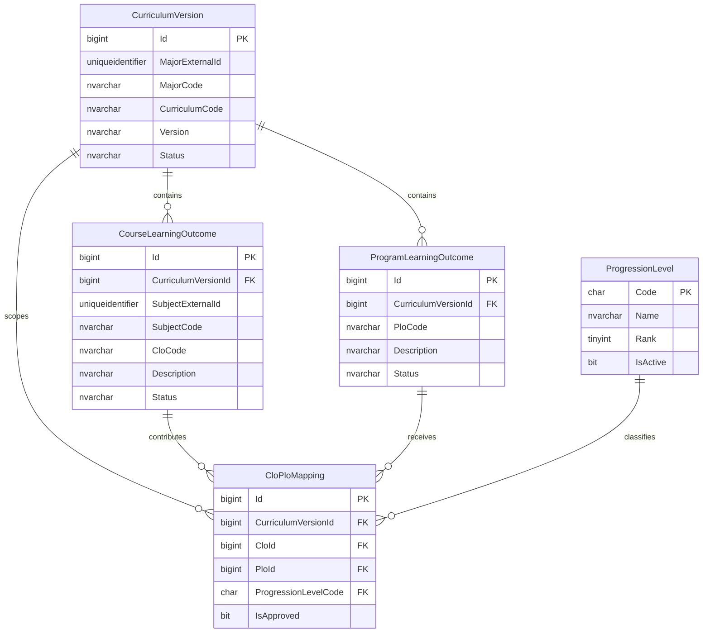

# Career schema

## Mục đích

Schema `career` lưu dữ liệu Academic-to-Career Mapping phục vụ quản lý phiên bản chương trình đào tạo, PLO, CLO và ma trận CLO–PLO theo tiến trình E–R–D. Đây là tầng CSDL quan hệ cho các chức năng JSON Document, vector matching và CV trong các giai đoạn sau.

Phạm vi hiện tại chỉ gồm SQL Server. Không có API, EF Core entity, upload DOCX, LLM, embedding hoặc giao diện.

## Quan hệ tổng quát

```text
CurriculumVersion
├── ProgramLearningOutcome
├── CourseLearningOutcome
├── ApprovedOutcomeJsonDocument
└── CloPloMapping
    ├── CourseLearningOutcome
    ├── ProgramLearningOutcome
    └── ProgressionLevel
```

Một `CurriculumVersion` thuộc một ngành thông qua tham chiếu mềm `MajorExternalId`. PLO và CLO thuộc một phiên bản chương trình. `CloPloMapping` nối CLO với PLO trong đúng cùng phiên bản và ghi mức đóng góp E, R hoặc D.

## Các bảng

### `career.CurriculumVersion`

Lưu một phiên bản cụ thể của chương trình đào tạo. Một ngành có thể có nhiều phiên bản theo thời gian.

| Cột | Kiểu | Null | Ý nghĩa |
|---|---|---:|---|
| `Id` | `BIGINT IDENTITY` | Không | Khóa chính nội bộ. |
| `MajorExternalId` | `UNIQUEIDENTIFIER` | Có | Tham chiếu mềm đến `academic.Majors.Id`; không có FK. |
| `MajorCode` | `NVARCHAR(100)` | Không | Snapshot mã ngành. |
| `MajorName` | `NVARCHAR(255)` | Không | Snapshot tên ngành. |
| `CurriculumCode` | `NVARCHAR(100)` | Không | Mã chương trình. |
| `CurriculumName` | `NVARCHAR(255)` | Có | Tên chương trình. |
| `Version` | `NVARCHAR(50)` | Không | Mã phiên bản. |
| `EffectiveFrom` | `DATE` | Có | Ngày bắt đầu hiệu lực. |
| `EffectiveTo` | `DATE` | Có | Ngày hết hiệu lực. |
| `Status` | `NVARCHAR(20)` | Không | `Draft`, `PendingReview`, `Approved`, `Archived`. |
| `Description` | `NVARCHAR(MAX)` | Có | Mô tả bổ sung. |
| `CreatedAt` | `DATETIME2(7)` | Không | Thời điểm tạo UTC. |
| `UpdatedAt` | `DATETIME2(7)` | Không | Thời điểm cập nhật UTC gần nhất. |
| `RowVersion` | `ROWVERSION` | Không | Token concurrency của SQL Server. |

### `career.ProgressionLevel`

Danh mục đóng E–R–D dùng trong ma trận CLO–PLO.

| Cột | Kiểu | Null | Ý nghĩa |
|---|---|---:|---|
| `Code` | `CHAR(1)` | Không | Khóa chính: `E`, `R` hoặc `D`. |
| `Name` | `NVARCHAR(50)` | Không | Tên tiếng Anh. |
| `VietnameseName` | `NVARCHAR(50)` | Không | Tên tiếng Việt. |
| `Description` | `NVARCHAR(1000)` | Không | Giải thích mức đóng góp. |
| `Rank` | `TINYINT` | Không | Thứ tự 1–3, duy nhất. |
| `IsActive` | `BIT` | Không | Trạng thái sử dụng. |
| `CreatedAt` | `DATETIME2(7)` | Không | Thời điểm tạo UTC. |

### `career.ProgramLearningOutcome`

Lưu PLO thuộc một phiên bản chương trình đào tạo.

| Cột | Kiểu | Null | Ý nghĩa |
|---|---|---:|---|
| `Id` | `BIGINT IDENTITY` | Không | Khóa chính. |
| `CurriculumVersionId` | `BIGINT` | Không | FK nội bộ đến `CurriculumVersion`. |
| `PloCode` | `NVARCHAR(50)` | Không | Mã PLO duy nhất trong phiên bản. |
| `Description` | `NVARCHAR(MAX)` | Không | Nội dung chính thức đã kiểm duyệt. |
| `OriginalDescription` | `NVARCHAR(MAX)` | Có | Nội dung nguyên bản trích xuất trong giai đoạn sau. |
| `NormalizedDescription` | `NVARCHAR(MAX)` | Có | Nội dung chuẩn hóa cho tìm kiếm/embedding sau này. |
| `SortOrder` | `INT` | Không | Thứ tự hiển thị, từ 0. |
| `Status` | `NVARCHAR(20)` | Không | `Draft`, `PendingReview`, `Approved`, `Rejected`, `Archived`. |
| `CreatedAt`, `UpdatedAt` | `DATETIME2(7)` | Không | Thời gian UTC. |
| `RowVersion` | `ROWVERSION` | Không | Token concurrency. |

### `career.CourseLearningOutcome`

Lưu CLO của một môn trong một phiên bản chương trình.

| Cột | Kiểu | Null | Ý nghĩa |
|---|---|---:|---|
| `Id` | `BIGINT IDENTITY` | Không | Khóa chính. |
| `CurriculumVersionId` | `BIGINT` | Không | FK nội bộ đến `CurriculumVersion`. |
| `SubjectExternalId` | `UNIQUEIDENTIFIER` | Có | Tham chiếu mềm đến `academic.Subjects.Id`; không có FK. |
| `SubjectCode` | `NVARCHAR(100)` | Không | Snapshot mã môn. |
| `SubjectName` | `NVARCHAR(255)` | Không | Snapshot tên môn. |
| `Credits` | `INT` | Có | Số tín chỉ; nếu có phải lớn hơn 0. |
| `CloCode` | `NVARCHAR(50)` | Không | Mã CLO duy nhất trong môn và phiên bản. |
| `Description` | `NVARCHAR(MAX)` | Không | Nội dung chính thức đã kiểm duyệt. |
| `OriginalDescription` | `NVARCHAR(MAX)` | Có | Nội dung nguyên bản cho pipeline sau. |
| `NormalizedDescription` | `NVARCHAR(MAX)` | Có | Nội dung chuẩn hóa cho embedding sau. |
| `SortOrder` | `INT` | Không | Thứ tự hiển thị, từ 0. |
| `Status` | `NVARCHAR(20)` | Không | Trạng thái vòng đời CLO. |
| `CreatedAt`, `UpdatedAt` | `DATETIME2(7)` | Không | Thời gian UTC. |
| `RowVersion` | `ROWVERSION` | Không | Token concurrency. |

### `career.CloPloMapping`

Lưu một ô có giá trị trong ma trận CLO–PLO.

| Cột | Kiểu | Null | Ý nghĩa |
|---|---|---:|---|
| `Id` | `BIGINT IDENTITY` | Không | Khóa chính. |
| `CurriculumVersionId` | `BIGINT` | Không | Phiên bản chứa cả CLO và PLO. |
| `CloId` | `BIGINT` | Không | CLO được ánh xạ. |
| `PloId` | `BIGINT` | Không | PLO được ánh xạ. |
| `ProgressionLevelCode` | `CHAR(1)` | Không | Mức E, R hoặc D. |
| `IsApproved` | `BIT` | Không | Mapping đã được kiểm duyệt. |
| `Note` | `NVARCHAR(1000)` | Có | Ghi chú kiểm duyệt. |
| `CreatedAt`, `UpdatedAt` | `DATETIME2(7)` | Không | Thời gian UTC. |
| `RowVersion` | `ROWVERSION` | Không | Token concurrency. |

### `career.ApprovedOutcomeJsonDocument`

Lưu snapshot JSON chính thức được tạo từ PLO, CLO và mapping trong SQL khi admin approve. `ContentJson`, `ContentHash`, schema/document version và provenance là bất biến; version cũ chỉ được chuyển lifecycle từ `Active` sang `Superseded`.

| Cột | Kiểu | Null | Ý nghĩa |
|---|---|---:|---|
| `Id` | `BIGINT IDENTITY` | Không | Khóa chính. |
| `CurriculumVersionId` | `BIGINT` | Không | FK đến curriculum chứa dữ liệu chính thức. |
| `ImportBatchId` | `BIGINT` | Không | FK duy nhất đến batch đã approve. |
| `SchemaVersion` | `NVARCHAR(20)` | Không | Phiên bản schema JSON. |
| `DocumentVersion` | `INT` | Không | Phiên bản tăng dần trong curriculum. |
| `ContentJson` | `NVARCHAR(MAX)` | Không | Canonical official JSON, bắt buộc hợp lệ. |
| `ContentHash` | `CHAR(64)` | Không | SHA-256 lowercase của UTF-8 `ContentJson`. |
| `Status` | `NVARCHAR(20)` | Không | `Active` hoặc `Superseded`. |
| `GeneratedAt` | `DATETIME2(7)` | Không | Thời điểm sinh UTC. |
| `GeneratedByExternalId`, `GeneratedByName` | `NVARCHAR` | Không | Admin thực hiện approve. |
| `SupersededAt` | `DATETIME2(7)` | Có | Thời điểm version mới thay thế. |
| `RowVersion` | `ROWVERSION` | Không | Token concurrency. |

## Tiến trình E–R–D

- **E — Enabling (Nền tảng):** CLO cung cấp kiến thức hoặc kỹ năng ban đầu cho PLO.
- **R — Reinforcing (Củng cố):** CLO mở rộng và tăng cường năng lực đã được hình thành.
- **D — Demonstrating (Thể hiện):** CLO yêu cầu sinh viên tổng hợp và thể hiện năng lực của PLO.

E–R–D mô tả mức đóng góp của một CLO vào một PLO. Đây không phải điểm năng lực trực tiếp của sinh viên.

## Ranh giới schema và tham chiếu mềm

`MajorExternalId` và `SubjectExternalId` dùng `UNIQUEIDENTIFIER` để tương thích với khóa hiện tại của `academic.Majors` và `academic.Subjects`, nhưng không có foreign key. Việc này giữ ranh giới schema-per-service, tránh phụ thuộc vòng đời giữa service và vẫn bảo toàn snapshot mã/tên nếu dữ liệu học vụ đổi.

Tất cả foreign key trong thiết kế chỉ nối các bảng thuộc schema `career`. Không foreign key nào dùng cascade delete; dữ liệu hết hiệu lực phải chuyển sang `Archived`.

## Constraint

| Bảng | Constraint chính |
|---|---|
| `CurriculumVersion` | Unique `(MajorCode, CurriculumCode, Version)`; status hợp lệ; ngày hiệu lực hợp lệ; mã/tên không rỗng. |
| `ProgressionLevel` | Code chỉ E/R/D; Rank chỉ 1/2/3 và duy nhất. |
| `ProgramLearningOutcome` | Unique `(CurriculumVersionId, PloCode)`; `SortOrder >= 0`; status hợp lệ. |
| `CourseLearningOutcome` | Unique `(CurriculumVersionId, SubjectCode, CloCode)`; `Credits > 0` nếu có; `SortOrder >= 0`; status hợp lệ. |
| `CloPloMapping` | Unique `(CurriculumVersionId, CloId, PloId)`; composite FK đảm bảo CLO và PLO cùng curriculum. |
| `ApprovedOutcomeJsonDocument` | Unique import batch; unique `(CurriculumVersionId, DocumentVersion)`; chỉ một `Active` document mỗi curriculum; JSON/hash/status hợp lệ. |

Hai unique key phụ `(Id, CurriculumVersionId)` trên PLO và CLO là khóa đích cho composite foreign key của mapping.

## Index

| Bảng | Index truy vấn |
|---|---|
| `ProgramLearningOutcome` | `CurriculumVersionId`; `Status`; `(CurriculumVersionId, Status)`. |
| `CourseLearningOutcome` | `CurriculumVersionId`; `SubjectCode`; `Status`; `(CurriculumVersionId, SubjectCode)`; `(CurriculumVersionId, Status)`. |
| `CloPloMapping` | `CloId`; `PloId`; `CurriculumVersionId`; `ProgressionLevelCode`; `(CurriculumVersionId, ProgressionLevelCode)`; `(PloId, ProgressionLevelCode)`. |
| `ApprovedOutcomeJsonDocument` | `(CurriculumVersionId, ContentHash)`; filtered unique active document. |

Các unique constraint tự tạo unique index tương ứng.

## ERD



## Ví dụ ma trận

| CLO | PLO1 | PLO2 | PLO3 |
|---|---|---|---|
| CLO1 môn A | E | R | |
| CLO2 môn A | | R | |
| CLO1 môn B | | | D |

## Script triển khai và rollback

Chạy theo thứ tự:

1. `001_create_career_schema.sql`
2. `002_create_career_tables.sql`
3. `003_seed_progression_levels.sql`
4. `004_create_career_indexes.sql`
5. `005_verify_career_schema.sql`

Các file SQL được lưu dưới dạng UTF-8 và chứa chuỗi Unicode tiếng Việt. Khi dùng
`sqlcmd`, phải thêm `-f 65001`, ví dụ:

```powershell
sqlcmd -S "<server>" -d TayDoV2 -E -C -b -f 65001 `
  -i "database/scripts/career/001_create_career_schema.sql"
```

`rollback_career_schema.sql` chỉ xóa năm bảng đã biết theo thứ tự phụ thuộc rồi xóa schema. Script sẽ từ chối chạy nếu schema có object ngoài phạm vi đã biết.

## EF Core Database First — tham khảo cho giai đoạn sau

Không chạy scaffold trong thay đổi này. Sau khi schema được duyệt, có thể dùng lệnh tương đương:

```powershell
dotnet ef dbcontext scaffold "<connection-string-from-secure-configuration>" `
  Microsoft.EntityFrameworkCore.SqlServer `
  --schema career `
  --context CareerDbContext `
  --context-dir Data `
  --output-dir Entities/Career `
  --no-onconfiguring
```

Không ghi connection string hoặc secret thật vào source code/tài liệu.
