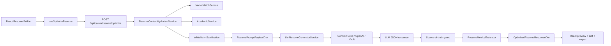

# Mô Tả Hệ Thống EducationSystem

## 1. Tổng Quan Hệ Thống

### 1.1. Giới Thiệu
- **Tên Dự Án**: EducationSystem - Hệ Thống Quản Lý Giáo Dục
- **Mô Tả**: Nền tảng quản lý giáo dục toàn diện cho các trường đại học/cao đẳng
- **Kiến Trúc**: Microservices theo mô hình Schema-per-Service
- **Công Nghệ**: .NET 8, ASP.NET Core Web API, Entity Framework Core, SQL Server

### 1.2. Các Dịch Vụ (Services)
Hệ thống bao gồm 6 dịch vụ độc lập:

| Dịch Vụ | Port HTTP | Port HTTPS | Schema DB | Mô Tả |
|---------|-----------|-----------|----------|-------|
| IdentityService | 5001 | 7001 | identity | Quản lý xác thực, người dùng, audit |
| AcademicService | 5002 | 7002 | academic | Quản lý học tập, lớp, sinh viên, điểm danh |
| ExamService | 5003 | 7003 | exam | Quản lý thi, câu hỏi, kết quả thi |
| CommunicationService | 5004 | 7004 | communication | Quản lý yêu cầu biểu mẫu, thông báo |
| CareerService | 5005 | 7005 | career | Import, trích xuất và kiểm duyệt PLO/CLO cùng ma trận CLO–PLO |
| VectorMatchService | 5006 | - | academic + career (read-only) | Sentence-BERT/FAISS tìm CLO và tiêu chí gần nghĩa với JD |

### 1.3. Cơ Sở Dữ Liệu
- **Số Bảng Theo EF Model Hiện Tại**: 47 bảng
- **Phân Bổ**: 
  - Identity: 5 bảng
  - Academic: 22 bảng
  - Exam: 8 bảng
  - Communication: 3 bảng
  - Career: 9 bảng
- **Kết Nối**: 5 connection strings của các .NET service và một cấu hình ODBC
  read-only cho VectorMatchService
- **Lưu ý triển khai**: hai bảng phục vụ CV là `academic.StudentProjects` và
  `academic.StudentInternships` đã có trong EF model nhưng chưa xuất hiện trong
  migration baseline hiện có trong repository. Cần bảo đảm database đích đã chạy
  migration/script tạo hai bảng trước khi bật chế độ lấy dữ liệu CV thật.

---

## 2. Các Vai Trò (Roles) và Tính Năng (Features) Người Dùng

### 2.1. Vai Trò Hệ Thống

| Vai Trò | Mô Tả | Tính Năng Chính |
|---------|-------|-----------------|
| **Admin** | Quản trị viên hệ thống | Quản lý toàn bộ dữ liệu, cài đặt hệ thống, audit logs |
| **Giáo Viên** | Người giảng dạy | Quản lý lớp, điểm danh, tạo đề thi, nhập điểm |
| **Sinh Viên** | Học viên | Xem lịch học, điểm danh, kết quả học tập, nộp yêu cầu |
| **Nhân Viên Đào Tạo** | Quản lý chương trình đào tạo | Quản lý môn học, lớp, lịch học, khóa học |

### 2.2. Tính Năng Chính

#### 2.2.1. Quản Lý Tài Khoản Người Dùng
- Đăng nhập với username/password
- Quản lý hồ sơ người dùng
- Phân quyền theo vai trò
- Audit log hoạt động
- Xử lý reset mật khẩu
- Quản lý thiết bị đăng nhập

#### 2.2.2. Quản Lý Học Viên
- Tạo/cập nhật/xóa thông tin học viên
- Ghi danh học phần
- Xem lịch học
- Xem kết quả học tập
- Quản lý thông tin cá nhân

#### 2.2.3. Quản Lý Môn Học
- Quản lý danh mục môn học
- Quản lý khoa/bộ môn
- Quản lý tài liệu môn học
- Định nghĩa tiêu chí đánh giá

#### 2.2.4. Quản Lý Lớp Học Phần
- Tạo lớp học phần
- Gán giáo viên
- Quản lý lịch học
- Quản lý phòng học
- Ghi danh sinh viên

#### 2.2.5. Quản Lý Điểm Danh
- Ghi nhận điểm danh
- Xem lịch sử điểm danh
- Cảnh cáo vắng mặt
- Báo cáo tỉ lệ vắng

#### 2.2.6. Quản Lý Thi
- Tạo đề thi
- Quản lý câu hỏi
- Tạo bộ câu hỏi
- Quản lý kỳ thi
- Nhập kết quả thi
- Xem chi tiết kết quả thi

#### 2.2.7. Quản Lý Đánh Giá
- Đánh giá sinh viên theo tiêu chí
- Xem kết quả đánh giá
- Báo cáo thống kê

#### 2.2.8. Quản Lý Yêu Cầu Biểu Mẫu
- Tạo yêu cầu biểu mẫu
- Duyệt yêu cầu
- Theo dõi trạng thái yêu cầu

#### 2.2.9. Quản Lý Thông Báo
- Gửi thông báo cho người dùng
- Xem lịch sử thông báo

#### 2.2.10. Tạo CV Thông Minh
- Tổng hợp hồ sơ, ngành học, GPA và học phần nổi bật từ dữ liệu học vụ
- Chọn dự án e-Portfolio và lịch sử thực tập đã xác nhận
- Nhập vị trí mục tiêu và mô tả công việc để định hướng nội dung
- Tối ưu cách diễn đạt bằng AI nhưng không tự tạo kinh nghiệm
- Cho phép sinh viên kiểm tra, chỉnh sửa và in/xuất PDF

#### 2.2.11. Import Và Kiểm Duyệt Chuẩn Đầu Ra CLO/PLO
- Quản trị viên chọn ngành, học phần và phiên bản chương trình đào tạo
- Upload tài liệu chuẩn đầu ra định dạng DOCX
- Tách nội dung DOCX thành các block có thể truy vết về đoạn văn hoặc bảng nguồn
- Dùng Gemini hoặc Groq để trích xuất PLO, CLO và ma trận CLO–PLO
- Đối soát mã học phần với dữ liệu chính thức từ AcademicService
- Hiển thị confidence, source reference, báo cáo chất lượng và lỗi validation
- Cho phép sửa, loại bỏ, khôi phục và kiểm tra lại dữ liệu draft
- Phê duyệt nguyên tử để ghi dữ liệu chính thức và sinh JSON có phiên bản/hash
- Từ chối, retry batch lỗi hoặc lưu trữ batch đã kết thúc

---

## 3. Chi Tiết 47 Bảng Dữ Liệu

### 3.1. Schema Identity (5 Bảng)

| STT | Tên Bảng | Entity Name | Số Cột | Mô Tả |
|-----|----------|-------------|--------|-------|
| 1 | Người Dùng | Users | 15+ | Lưu trữ thông tin người dùng, tài khoản đăng nhập, vai trò, hồ sơ cá nhân |
| 2 | Nhật Ký Kiểm Tra | AuditLogs | 8+ | Ghi lại tất cả các hoạt động của người dùng trong hệ thống (thay đổi dữ liệu, truy cập) |
| 3 | Reset Mật Khẩu | PasswordResets | 5+ | Quản lý yêu cầu reset mật khẩu, token xác thực, thời hạn hết hạn |
| 4 | Cài Đặt Hệ Thống | Settings | 5+ | Lưu trữ các cài đặt toàn cục của hệ thống (cấu hình, thông số) |
| 5 | Thiết Bị Người Dùng | UserDevices | 8+ | Theo dõi các thiết bị đăng nhập của người dùng (mobile, máy tính, push notification) |

### 3.2. Schema Academic (22 Bảng)

| STT | Tên Bảng | Entity Name | Số Cột | Mô Tả |
|-----|----------|-------------|--------|-------|
| 1 | Sinh Viên | Students | 30+ | Thông tin cá nhân sinh viên, khóa học, ngành học, trạng thái học tập |
| 2 | Năm Học | AcademicYears | 5+ | Định nghĩa các năm học (ví dụ: 2023-2024, 2024-2025) |
| 3 | Chuyên Ngành | Majors | 8+ | Danh sách chuyên ngành đào tạo, mã chuyên ngành, mô tả |
| 4 | Khoa/Bộ Môn | Faculties | 8+ | Danh sách các khoa hoặc bộ môn trong trường |
| 5 | Môn Học | Subjects | 10+ | Danh mục môn học (mã, tên, tín chỉ, giờ học, trạng thái) |
| 6 | Lớp Học Phần | SubjectTeachings | 12+ | Triển khai môn học thành các lớp (thời gian bắt đầu, kết thúc, số buổi, phòng) |
| 7 | Giáo Viên Lớp HP | SubjectTeachingTeachers | 5+ | Gắn giáo viên với lớp học phần (hỗ trợ nhiều giáo viên) |
| 8 | Ghi Danh Học Phần | SubjectStudents | 5+ | Bảng nối giữa sinh viên và lớp học phần (ghi danh/enrollment) |
| 9 | Lịch Học | SubjectSchedules | 10+ | Chi tiết từng buổi học (thời gian bắt đầu-kết thúc, phòng, giáo viên, ghi chú) |
| 10 | Phòng Học | Rooms | 8+ | Danh sách phòng học, sức chứa, vị trí, trang thiết bị |
| 11 | Điểm Danh | Attendances | 8+ | Ghi nhận điểm danh sinh viên tại các buổi học (có/vắng, cảnh cáo) |
| 12 | Tài Liệu Môn Học | SubjectDocuments | 8+ | Tài liệu liên quan đến môn học (giáo trình, slide, bài tập) |
| 13 | Ghi Chú Đặc Biệt | SubjectSpecialNotes | 8+ | Ghi chú đặc biệt cho sinh viên (miễn điểm danh, ngoại lệ, v.v.) |
| 14 | Tiêu Chí Đánh Giá | EvaluationCriterias | 10+ | Định nghĩa tiêu chí đánh giá cho môn học (điểm giữa kỳ, cuối kỳ, bài tập) |
| 15 | Đánh Giá Sinh Viên | StudentEvaluations | 12+ | Đánh giá tổng hợp sinh viên trong một môn (tổng điểm, trạng thái pass/fail) |
| 16 | Chi Tiết Đánh Giá | StudentEvaluationDetails | 8+ | Điểm chi tiết từng tiêu chí đánh giá (điểm giữa kỳ, cuối kỳ, bài tập) |
| 17 | Kế Hoạch Kỳ Học | SemesterPlans | 8+ | Kế hoạch môn học theo từng kỳ cho mỗi ngành (ngành + năm = các môn phải học) |
| 18 | Môn Trong Kế Hoạch | SemesterSubjects | 8+ | Danh sách môn trong kế hoạch kỳ học (môn nào, bắt buộc hay tự chọn) |
| 19 | Học Phí Theo Kỳ | SemesterTuitions | 8+ | Học phí của sinh viên từng kỳ học (số tiền, trạng thái đã đóng) |
| 20 | Giáo Viên-Khoa | TeacherFaculties | 5+ | Gắn giáo viên với khoa/bộ môn (mỗi giáo viên thuộc một khoa) |
| 21 | Dự Án Sinh Viên | StudentProjects | 10 | Lưu dự án e-Portfolio do sinh viên sở hữu, công nghệ, vai trò, đóng góp và môn học liên quan để làm nguồn tạo CV |
| 22 | Lịch Sử Thực Tập | StudentInternships | 8 | Lưu đợt thực tập đã được đồng bộ sau quy trình xác nhận/phê duyệt, dùng làm kinh nghiệm có nguồn kiểm chứng trên CV |

### 3.3. Schema Exam (8 Bảng)

| STT | Tên Bảng | Entity Name | Số Cột | Mô Tả |
|-----|----------|-------------|--------|-------|
| 1 | Câu Hỏi | Questions | 8+ | Câu hỏi trong ngân hàng (nội dung, ảnh, mức độ khó) |
| 2 | Đáp Án Câu Hỏi | QuestionAnswers | 8+ | Các lựa chọn trả lời cho mỗi câu hỏi (đáp án, ảnh, đáp án đúng) |
| 3 | Bộ Câu Hỏi | QuestionSuites | 8+ | Nhóm câu hỏi theo chủ đề/môn học (tên bộ, môn, thời gian tạo) |
| 4 | Kỳ Thi Lớp HP | SubjectTeachingExams | 10+ | Kỳ thi cho một lớp học phần (bộ câu hỏi, phòng, thời gian, giáo viên coi thi) |
| 5 | Lần Thi | ExamAttempts | 8+ | Mỗi lần sinh viên tham gia thi (kỳ thi, thời gian thi, IP, trạng thái) |
| 6 | Kết Quả Thi | ExamResults | 10+ | Kết quả thi của sinh viên (điểm, lần thi, trạng thái pass/fail, ghi chú) |
| 7 | Câu Hỏi Trong Thi | ExamQuestionSelections | 8+ | Danh sách câu hỏi được chọn cho một lần thi (câu nào, thứ tự, điểm) |
| 8 | Đáp Án Trong Thi | ExamQuestionAnswers | 8+ | Đáp án sinh viên đã chọn khi làm bài thi (lần thi, câu hỏi, đáp án chọn) |

### 3.4. Schema Communication (3 Bảng)

| STT | Tên Bảng | Entity Name | Số Cột | Mô Tả |
|-----|----------|-------------|--------|-------|
| 1 | Mẫu Biểu Mẫu | FormTemplates | 8+ | Mẫu các biểu mẫu có thể yêu cầu (đơn xin học lại, xin miễn, v.v.) |
| 2 | Yêu Cầu Biểu Mẫu | FormRequests | 10+ | Yêu cầu từ sinh viên (loại mẫu, sinh viên, người duyệt, trạng thái) |
| 3 | Thông Báo Người Dùng | UserAnnouncements | 8+ | Thông báo hệ thống gửi đến người dùng (tiêu đề, nội dung, trạng thái đã đọc) |

### 3.5. Schema Career (9 Bảng)

| STT | Tên Bảng | Entity Name | Mô Tả |
|-----|----------|-------------|-------|
| 1 | Phiên Bản Chương Trình | CurriculumVersions | Snapshot ngành, mã chương trình, phiên bản, thời gian hiệu lực và trạng thái để gắn dữ liệu chuẩn đầu ra |
| 2 | Chuẩn Đầu Ra Chương Trình | ProgramLearningOutcomes | PLO chính thức của một phiên bản chương trình sau khi được phê duyệt |
| 3 | Chuẩn Đầu Ra Học Phần | CourseLearningOutcomes | CLO chính thức, kèm snapshot mã/tên/ID học phần và số tín chỉ |
| 4 | Mức Tiến Trình | ProgressionLevels | Danh mục mức đóng góp E/R/D dùng trong ma trận CLO–PLO |
| 5 | Ánh Xạ CLO–PLO | CloPloMappings | Liên kết CLO với PLO và mức tiến trình E/R/D trong cùng curriculum |
| 6 | Batch Import Chuẩn Đầu Ra | OutcomeImportBatches | File, hash, học phần được chọn, trạng thái xử lý, JSON staging, lỗi, actor và rowversion |
| 7 | Block Tài Liệu Nguồn | OutcomeDocumentBlocks | Các heading, paragraph và table được tách từ DOCX để truy vết nguồn |
| 8 | Nhật Ký Kiểm Duyệt | OutcomeReviewLogs | Lịch sử edit/remove/restore/validate/approve/reject/archive của quản trị viên |
| 9 | JSON Chuẩn Đầu Ra Đã Duyệt | ApprovedOutcomeJsonDocuments | Official JSON bất biến được dựng lại từ dữ liệu SQL đã duyệt, có version, SHA-256 và provenance |

---

## 4. Sơ Đồ Quan Hệ Dữ Liệu Chính

### Luồng Dữ Liệu Học Tập
```
Ngành (Major) 
  ↓
Kế Hoạch Kỳ Học (SemesterPlans)
  ↓
Môn Trong Kế Hoạch (SemesterSubjects)
  ↓
Môn Học (Subjects)
  ↓
Lớp Học Phần (SubjectTeachings)
  ↓
Ghi Danh Học Phần (SubjectStudents) ← Sinh Viên (Students)
  ↓
Lịch Học (SubjectSchedules)
  ↓
Điểm Danh (Attendances)
  ↓
Đánh Giá Sinh Viên (StudentEvaluations) → Kết Quả Thi (ExamResults)
```

### Luồng Dữ Liệu Thi Cử
```
Bộ Câu Hỏi (QuestionSuites)
  ↓
Câu Hỏi (Questions) + Đáp Án (QuestionAnswers)
  ↓
Kỳ Thi Lớp HP (SubjectTeachingExams)
  ↓
Lần Thi (ExamAttempts) ← Sinh Viên (Students)
  ↓
Kết Quả Thi (ExamResults)
  ↓
Câu Hỏi Trong Thi (ExamQuestionSelections) + Đáp Án Trong Thi (ExamQuestionAnswers)
```

### Luồng Dữ Liệu Yêu Cầu
```
Mẫu Biểu Mẫu (FormTemplates)
  ↓
Yêu Cầu Biểu Mẫu (FormRequests) ← Sinh Viên (Students) + Người Duyệt
  ↓
Trạng Thái (Đang Chờ / Phê Duyệt / Từ Chối)
```

### Luồng Import Và Kiểm Duyệt CLO/PLO

```text
Quản trị viên chọn Ngành → Học phần → Phiên bản chương trình
                              ↓
                         Upload DOCX
                              ↓
            career.OutcomeImportBatches (Uploaded)
                              ↓
                       Worker xử lý nền
                              ↓
 Parse DOCX → LLM trích xuất → Reconcile → Rule validation
      ↓              ↓                            ↓
 Source blocks   Draft PLO/CLO/mapping     AcademicService đối chiếu môn
                              ↓
              PendingReview / ValidationFailed
                              ↓
            Admin sửa, xem nguồn, validate lại
                              ↓
                Approve / Reject / Archive
                              ↓
 Khi Approve: ProgramLearningOutcomes + CourseLearningOutcomes
              + CloPloMappings + ApprovedOutcomeJsonDocuments
```

---

## 5. Dữ Liệu Dùng Cho Tính Năng Tạo CV Tự Động

### 5.1. Phạm Vi Và Trạng Thái Hiện Tại

Tính năng nằm tại trang `/student/resume-builder`. Dữ liệu học vụ được chuẩn bị
bởi `AcademicService` qua API:

```http
GET /api/academic/resume/get-context-data/{studentId}
```

API yêu cầu token sinh viên và chỉ cho phép sinh viên đọc đúng dữ liệu thuộc
`studentId` trong token. Dữ liệu thực tập được giao diện tải thêm qua:

```http
GET /api/academic/students/{studentId}/internships
```

Khi tối ưu bằng AI ở chế độ thật, frontend gửi request đã whitelist đến
CareerService:

```http
POST /api/career/resume/optimize
```

Endpoint dùng Context Hydration BFF, Gemini/Groq/OpenAI JSON mode,
source-of-truth guard và metrics evaluator. Project đã chỉnh trên UI,
internship IDs được chọn và summary draft đều được hỗ trợ; PII/contact/static
fields không được gửi LLM.
`VITE_AI_OPTIMIZE_MODE` mặc định không phải `live`, nên nút **Tối ưu hóa CV
bằng AI** đang chạy dữ liệu mô phỏng ở frontend. Tương tự,
`VITE_RESUME_API_MODE` phải bằng `live` thì ngữ cảnh học vụ mới được tải từ
backend.

### 5.2. Luồng Dữ Liệu Tổng Quát

```text
identity.Users
   └─ họ tên, tên đăng nhập
             │
academic.Students ── Majors ── Faculties ── AcademicYears
             │
             ├─ StudentEvaluations ── SubjectTeachings ── Subjects
             │         └─ StudentEvaluationDetails ── EvaluationCriterias
             │                 → GPA + học phần đủ điều kiện + chuẩn đầu ra
             │
             ├─ StudentProjects
             │                 → dự án, công nghệ, vai trò, đóng góp
             │
             └─ StudentInternships
                       ↑ đồng bộ sau khi communication.FormRequests được duyệt
                               → kinh nghiệm thực tập đã xác nhận

Sinh viên nhập/chọn thêm: vị trí mục tiêu + JD + thông tin liên hệ
             ↓
Payload tối ưu CV
             ↓
AI chỉ diễn đạt lại → tóm tắt nghề nghiệp + nhóm kỹ năng
             ↓
Sinh viên kiểm tra/chỉnh sửa → in hoặc xuất PDF
```

### 5.3. Các Bảng Được Sử Dụng

#### 5.3.1. Bảng Được API Ngữ Cảnh CV Truy Vấn Trực Tiếp

| Schema | Bảng | Vai Trò Trong CV |
|---|---|---|
| `academic` | `Students` | Bảng gốc xác định chủ sở hữu CV, liên kết tài khoản, ngành và năm học |
| `identity` | `Users` | Cung cấp họ tên và tên đăng nhập qua internal API; chỉ lấy tài khoản đang hoạt động, chưa xóa |
| `academic` | `Majors` | Cung cấp mã và tên ngành học |
| `academic` | `Faculties` | Cung cấp tên khoa, có thể rỗng |
| `academic` | `AcademicYears` | Cung cấp tên khóa/năm học |
| `academic` | `StudentEvaluations` | Cung cấp `TotalScore`, là nguồn tính điểm môn và GPA |
| `academic` | `SubjectTeachings` | Nối một đánh giá với môn học cụ thể |
| `academic` | `Subjects` | Cung cấp mã môn, tên môn, số tín chỉ |
| `academic` | `StudentEvaluationDetails` | Cung cấp tên kết quả/tiêu chí chi tiết của học phần |
| `academic` | `EvaluationCriterias` | Cung cấp tên và mô tả tiêu chí để suy ra năng lực/chuẩn đầu ra |
| `academic` | `StudentProjects` | Cung cấp dự án e-Portfolio của sinh viên |
| `academic` | `StudentInternships` | Cung cấp lịch sử thực tập dùng trong phần kinh nghiệm |

#### 5.3.2. Bảng Nguồn Gián Tiếp Cho Thực Tập

| Schema | Bảng | Vai Trò |
|---|---|---|
| `communication` | `FormRequests` | Lưu khai báo thực tập, token xác nhận của doanh nghiệp, trạng thái xác nhận và phê duyệt. Khi nhà trường duyệt, dữ liệu cần thiết được sao chép sang `academic.StudentInternships` |

`communication.FormRequests` không được API CV join trực tiếp vì hệ thống dùng
mô hình schema-per-service. Hai service liên kết logic bằng
`StudentInternships.FormRequestID`, không có khóa ngoại EF xuyên service.
`FormTemplates` không tham gia trực tiếp vào luồng CV/thực tập hiện tại vì yêu
cầu thực tập được tạo bằng endpoint riêng và có thể không có `FormTemplateID`.

### 5.4. Chi Tiết Trường Dữ Liệu Database

#### 5.4.1. Hồ Sơ Sinh Viên

| Bảng.Trường | Bắt Buộc | Được Chuyển Thành | Ý Nghĩa Cho CV/AI |
|---|---:|---|---|
| `Students.Id` | Có | `student.studentId` | Định danh sinh viên, dùng để giới hạn quyền sở hữu và truy vấn tất cả dữ liệu liên quan |
| `Students.UserId` | Có | `student.userId` | Khóa liên kết logic đến `identity.Users.Id` |
| `Students.MajorId` | Có | Quan hệ đến `Majors` | Xác định ngành học |
| `Students.AcademicYearId` | Có | Quan hệ đến `AcademicYears` | Xác định khóa/năm học |
| `Students.IsDeleted` | Có | Bộ lọc | Chỉ lấy sinh viên chưa bị xóa mềm |
| `Users.FullName` | Có | `student.fullName` | Họ tên hiển thị ở đầu CV |
| `Users.UserName` | Có | `student.userName` | Hiện được backend trả về; có thể dùng làm mã sinh viên nếu nghiệp vụ bảo đảm hai giá trị là một |
| `Users.IsActived` | Có | Bộ lọc | Chỉ cho phép hồ sơ tài khoản đang hoạt động |
| `Users.IsDeleted` | Có | Bộ lọc | Loại tài khoản đã xóa mềm |
| `Majors.Code` | Có | `student.majorCode` | Mã ngành, hữu ích cho chuẩn hóa/phân tích |
| `Majors.Name` | Có | `student.majorName` | Tên ngành hiển thị trong phần học vấn và cung cấp ngữ cảnh chuyên môn cho AI |
| `Majors.FacultyId` | Không | Quan hệ đến `Faculties` | Xác định khoa nếu có |
| `Faculties.Name` | Không | `student.facultyName` | Tên khoa; backend trả về nhưng frontend hiện chưa dùng |
| `AcademicYears.Name` | Có | `student.academicYear` | Tên khóa/năm học; backend trả về nhưng frontend hiện chưa dùng |

Các trường nhạy cảm khác trong `Students`/`Users` như mật khẩu, salt, số giấy tờ,
thông tin cha mẹ, tôn giáo, dân tộc hoặc dữ liệu đoàn/đảng **không được truy vấn
và không được gửi cho AI**.

#### 5.4.2. Điểm, GPA Và Học Phần Tiêu Biểu

| Bảng.Trường | Được Chuyển Thành | Quy Tắc Hiện Tại | Ý Nghĩa Cho CV/AI |
|---|---|---|---|
| `StudentEvaluations.StudentId` | Bộ lọc | Chỉ lấy đánh giá của sinh viên đang tạo CV | Bảo đảm đúng chủ sở hữu |
| `StudentEvaluations.TotalScore` | `eligibleCourses[].score` và `gpa` | Chỉ nhận điểm khác `null`, từ 0 đến 10; nếu một môn có nhiều dòng thì lấy trung bình | Bằng chứng định lượng cho năng lực học thuật |
| `StudentEvaluations.IsDeleted` | Bộ lọc | Phải bằng `false` | Không dùng dữ liệu đã xóa |
| `StudentEvaluations.SubjectTeachingId` | Quan hệ | Phải nối được đến lớp học phần chưa xóa | Tìm môn tương ứng |
| `SubjectTeachings.SubjectId` | Quan hệ đến `Subjects` | Lớp học phần phải chưa xóa | Gom các lần đánh giá theo cùng môn |
| `Subjects.Id` | `eligibleCourses[].subjectId` | Dùng làm định danh lựa chọn | Tham chiếu ổn định cho frontend |
| `Subjects.SubjectCode` | `eligibleCourses[].subjectCode` | Sắp xếp tăng dần khi điểm bằng nhau | Hiển thị mã môn |
| `Subjects.Name` | `eligibleCourses[].subjectName` | Môn phải chưa xóa | Hiển thị tên môn và tạo ngữ cảnh kỹ năng |
| `Subjects.CreditPoint` | `eligibleCourses[].creditPoint` | Dùng làm trọng số GPA | Phản ánh khối lượng học tập |
| `StudentEvaluationDetails.EvaluationName` | `courseOutcomes[].name` | Ưu tiên nếu có; chi tiết phải chưa xóa | Tên năng lực/kết quả đánh giá |
| `StudentEvaluationDetails.EvaluationCriteriaId` | Quan hệ | Dùng khi `EvaluationName` rỗng hoặc cần mô tả | Nối đến tiêu chí chuẩn |
| `EvaluationCriterias.Name` | `courseOutcomes[].name` | Giá trị dự phòng cho `EvaluationName` | Nhãn năng lực có thể đưa vào prompt |
| `EvaluationCriterias.Description` | `courseOutcomes[].description` | Lấy mô tả không rỗng đầu tiên của cùng một tên | Cung cấp ngữ nghĩa chi tiết cho AI |

Quy tắc tính hiện tại:

- Điểm của một môn = trung bình tất cả `TotalScore` hợp lệ của môn đó, làm tròn
  2 chữ số.
- GPA = trung bình có trọng số theo `CreditPoint`; nếu tổng tín chỉ bằng 0 thì
  dùng trung bình cộng; kết quả làm tròn 2 chữ số.
- Chỉ môn có điểm trung bình từ `7.0/10` trở lên được đưa vào
  `eligibleCourses`.
- Học phần đủ điều kiện được sắp xếp theo điểm giảm dần, sau đó theo mã môn.
- Chuẩn đầu ra trùng tên được gộp không phân biệt chữ hoa/chữ thường.

Đây là GPA nội bộ được tính từ các dòng đánh giá hợp lệ mà service đọc được,
không phải trường GPA chính thức đã lưu sẵn và cũng chưa có quy tắc chọn lần
học/lần thi tốt nhất.

#### 5.4.3. Dự Án Sinh Viên (`academic.StudentProjects`)

| Trường | Kiểu/Ràng Buộc EF | Trường API | Mục Đích Cho CV/AI |
|---|---|---|---|
| `ProjectID` | `int`, identity, PK | `projectId` | Định danh dự án |
| `StudentID` | `uniqueidentifier`, FK `Students`, cascade delete | Không cần hiển thị | Xác định chủ sở hữu |
| `ProjectName` | `nvarchar(255)`, bắt buộc | `projectName` | Tên dự án |
| `TechStack` | `varchar(255)`, bắt buộc | `techStack` | Công nghệ/kỹ thuật đã sử dụng |
| `ProjectDescription` | `nvarchar(max)`, có thể rỗng | `projectDescription` | Bối cảnh, mục tiêu và phạm vi dự án |
| `SourceCodeUrl` | `varchar(255)`, có thể rỗng | `sourceCodeUrl` | Link GitHub/source code để minh chứng |
| `TeamSize` | `int`, mặc định 1, phải `>= 1` | `teamSize` | Phân biệt dự án cá nhân/nhóm |
| `MyRole` | `nvarchar(100)`, có thể rỗng | `myRole` | Vai trò thực tế của sinh viên |
| `MyContributions` | `nvarchar(max)`, có thể rỗng | `myContributions` | Phần việc/kết quả cá nhân; là dữ liệu quan trọng nhất để AI viết bullet không bịa đặt |
| `MappedCourseID` | `uniqueidentifier`, FK `Subjects`, có thể rỗng, set null khi môn bị xóa | `mappedCourseId`, `mappedCourseCode`, `mappedCourseName` | Chứng minh dự án liên quan đến học phần nào |

#### 5.4.4. Thực Tập (`academic.StudentInternships`)

| Trường | Kiểu/Ràng Buộc EF | Trường API | Mục Đích Cho CV/AI |
|---|---|---|---|
| `InternshipID` | `int`, identity, PK | `internshipId` | Định danh đợt thực tập |
| `StudentID` | `uniqueidentifier`, FK `Students`, cascade delete | `studentId` ở API danh sách | Xác định chủ sở hữu |
| `CompanyName` | `nvarchar(255)`, bắt buộc | `companyName` | Tên doanh nghiệp |
| `Position` | `nvarchar(100)`, bắt buộc | `position` | Vị trí thực tập |
| `StartDate` | `date`, bắt buộc | `startDate` | Thời điểm bắt đầu |
| `EndDate` | `date`, có thể rỗng và không nhỏ hơn `StartDate` | `endDate` | Thời điểm kết thúc hoặc “Hiện tại” |
| `TaskDescription` | `nvarchar(max)`, có thể rỗng | `taskDescription` | Nhiệm vụ thực tế để AI diễn đạt thành kinh nghiệm |
| `FormRequestID` | `uniqueidentifier`, có thể rỗng, index | `formRequestId` ở API danh sách | Truy vết yêu cầu thực tập đã được duyệt bên CommunicationService |

Luồng tạo dữ liệu thực tập:

1. Sinh viên khai báo `CompanyName`, `Position`, `MentorEmail`, `StartDate`,
   `EndDate`, `TaskDescription`.
2. Dữ liệu được lưu trong `communication.FormRequests.VerificationData` dưới
   dạng JSON và gửi token xác nhận cho doanh nghiệp.
3. Doanh nghiệp xác nhận thông tin, chấm điểm và có thể ghi nhận xét.
4. Nhà trường duyệt yêu cầu.
5. CommunicationService gọi internal API để sao chép các trường cần cho CV sang
   `academic.StudentInternships`; `MentorEmail`, điểm và nhận xét của doanh
   nghiệp không được sao chép sang CV.

### 5.5. Hợp Đồng Dữ Liệu API Ngữ Cảnh CV

API Academic hiện trả về cấu trúc logic sau:

| Nhóm | Trường | Nguồn | Tác Dụng Dự Kiến |
|---|---|---|---|
| `student` | `studentId`, `userId` | `Students` | Định danh và truy vết, không cần đưa vào nội dung prompt tự do |
| `student` | `fullName`, `userName` | `identity.Users` | Họ tên và mã/tên đăng nhập |
| `student` | `majorCode`, `majorName` | `Majors` | Ngữ cảnh ngành học |
| `student` | `facultyName` | `Faculties` | Ngữ cảnh khoa |
| `student` | `academicYear` | `AcademicYears` | Khóa/năm học |
| root | `gpa` | Giá trị tính từ đánh giá | Điểm trung bình 0–10 hoặc `null` |
| `eligibleCourses[]` | `subjectId`, `subjectCode`, `subjectName`, `creditPoint`, `score` | Đánh giá + lớp học phần + môn | Danh sách môn nổi bật |
| `eligibleCourses[].courseOutcomes[]` | `name`, `description` | Chi tiết đánh giá + tiêu chí | Nguồn suy ra kiến thức/kỹ năng có căn cứ |
| `projects[]` | Toàn bộ trường ở mục 5.4.3 | `StudentProjects` + môn được map | Dự án thực tế |
| `approvedInternships[]` | `internshipId`, `companyName`, `position`, `startDate`, `endDate`, `taskDescription` | `StudentInternships` | Kinh nghiệm thực tập |

### 5.6. Dữ Liệu Frontend Đang Gửi Cho Endpoint AI

Khi `VITE_AI_OPTIMIZE_MODE=live`, frontend không gửi toàn bộ `ResumeData`.
Adapter tạo `PrepareResumePayloadRequestDto` đã giới hạn:

| Trường gửi | Nguồn | Cách backend sử dụng |
|---|---|---|
| `studentId` | Student session | Kiểm tra ownership, không gửi LLM |
| `targetRole` | Sinh viên nhập | Định hướng nội dung CV |
| `jobDescription` | Sinh viên dán | Vector match và căn chỉnh từ khóa |
| `selectedSubjectIds` | Học phần được chọn | Backend hydrate môn/điểm/CLO đã xác nhận |
| `selectedInternshipIds` | Checkbox thực tập | Chỉ hydrate đúng internship đã duyệt/được chọn |
| `uiProjects` | Project đã chỉnh trên UI | Nguồn ưu tiên cho role/contribution/team size |
| `currentSummaryDraft` | Summary hiện tại | Tinh chỉnh tăng dần, không viết lại từ đầu |
| `topK`, `similarityThreshold` | Cấu hình adapter | Giới hạn semantic matching |

`email`, `phone`, `location`, `university`, GitHub URL và source-code URL không
được gửi. Chúng chỉ tồn tại trong state UI để render/in PDF.

### 5.7. Các Khoảng Trống Còn Lại

1. **Một số trường backend chưa được frontend dùng**:
   `student.userId`, `majorCode`, `facultyName`, `academicYear`,
   `eligibleCourses.creditPoint`, `projects.projectDescription`,
   `mappedCourseId`, `mappedCourseCode` và `mappedCourseName`.
2. **Một số trường trên CV vẫn là mock/static**: `email`, `phone`,
   `location`, `university` và khoảng thời gian học `2023–2027`. Cần bổ sung
   nguồn dữ liệu chính thức hoặc bắt sinh viên xác nhận; các trường này vẫn
   không được gửi LLM.
3. **Dự án chỉnh sửa/thêm trên giao diện chưa được ghi về database**:
   Resume Generator sử dụng chúng trong request hiện tại, nhưng reload trang
   vẫn mất thay đổi vì chưa có API CRUD `StudentProjects`.
4. **Bản CV chưa được lưu bền vững**: nhãn “Đã lưu” hiện không tương ứng với
   API/local storage. Reload trang sẽ mất chỉnh sửa trong phiên.
5. **Thông tin thực tập bị tải hai lần**: context đã trả
   `approvedInternships`, nhưng frontend lại gọi endpoint danh sách thực tập
   riêng. Nên chọn một nguồn để tránh lệch dữ liệu.
6. **Tên `approvedInternships` phụ thuộc quy trình ghi dữ liệu**:
   `ResumeDataService` đọc toàn bộ `StudentInternships` theo sinh viên, không
   kiểm tra `FormRequestID` khác `null` hay gọi CommunicationService để xác
   nhận trạng thái. Hiện tính “đã duyệt” được bảo đảm bởi luồng đồng bộ, không
   phải bởi điều kiện truy vấn.
7. **Migration chưa đồng bộ EF model**: snapshot/baseline migration hiện chưa
   chứa `StudentProjects` và `StudentInternships`.

### 5.8. Prompt Payload Đã Triển Khai

`ResumePromptPayloadDto` được CareerService hydrate, sanitize và serialize cho
LLM. Student ID/code là metadata `[JsonIgnore]`; contact/static fields không có
trong DTO:

```json
{
  "targetRole": "Frontend Developer Intern",
  "jobDescription": "...",
  "currentSummaryDraft": "...",
  "studentInfo": {
    "fullName": "...",
    "majorName": "...",
    "gpa": 8.12
  },
  "matchedSubjects": [
    {
      "subjectCode": "CT312",
      "subjectName": "Lập trình Web",
      "creditPoint": 3,
      "score": 8.2,
      "courseOutcomes": [
        {
          "outcomeCode": "CLO1",
          "description": "...",
          "similarityScore": 0.87,
          "progressionLevel": "D"
        }
      ]
    }
  ],
  "projects": [
    {
      "projectId": 7,
      "projectName": "...",
      "techStack": "React, TypeScript",
      "teamSize": 4,
      "myRole": "Frontend Developer",
      "myContributions": "..."
    }
  ],
  "internships": [
    {
      "companyName": "...",
      "position": "...",
      "startDate": "2026-01-01",
      "endDate": "2026-04-30",
      "taskDescription": "..."
    }
  ],
  "isFallbackMode": false
}
```

Output của AI nên là JSON có schema cố định và chỉ chứa nội dung được phép viết
lại, ví dụ `professionalSummary`, `skills` và các bullet đề xuất cho từng
`projectId`/`internshipId`. Các trường định danh, họ tên, liên hệ, điểm, ngày,
công ty và URL phải được copy từ dữ liệu nguồn, không cho model tự sinh.

### 5.9. Nguyên Tắc An Toàn Và Chất Lượng Dữ Liệu AI

- Chỉ gửi các trường đã whitelist trong DTO, không serialize trực tiếp entity
  database.
- Không gửi `PasswordHash`, `PasswordSalt`, `IdentificationNumber`,
  `EmployerToken`, `MentorEmail` hoặc dữ liệu gia đình/chính trị/tôn giáo.
- Cho sinh viên xem và xác nhận dữ liệu nguồn trước khi gọi AI.
- Prompt phải yêu cầu không tạo thêm kinh nghiệm, công nghệ, thành tích hoặc số
  liệu không có trong nguồn.
- Lưu `sourceId` và phiên bản dữ liệu cho mỗi câu/bullet AI sinh ra để có thể
  truy vết.
- Validate output bằng JSON schema; giới hạn độ dài, loại HTML/script và URL
  không an toàn.
- Tách log kỹ thuật khỏi nội dung CV; không ghi nguyên JD/CV vào log nếu không
  có mục đích và thời hạn lưu rõ ràng.
- `Content Preservation` và `Job Alignment` được
  `ResumeMetricsEvaluator` tính lại phía server sau fact guard; UI chỉ đổi score
  `0.0–1.0` thành phần trăm.

---

## 6. CareerService — Import Và Kiểm Duyệt CLO/PLO

### 6.1. Phạm Vi Đã Triển Khai

`CareerService` chuyển tài liệu chuẩn đầu ra dạng DOCX thành dữ liệu có cấu
trúc để quản trị viên kiểm duyệt trước khi publish. Service hiện chịu trách
nhiệm:

- quản lý snapshot phiên bản chương trình đào tạo;
- tiếp nhận và lưu file DOCX ngoài web root;
- trích xuất curriculum metadata, PLO, học phần/CLO và ma trận CLO–PLO;
- truy vết mỗi kết quả về block trong tài liệu nguồn;
- đối soát, validation và tính báo cáo chất lượng;
- cung cấp workspace để sửa và duyệt draft;
- publish dữ liệu chính thức theo cơ chế insert-only;
- sinh official JSON từ dữ liệu SQL đã duyệt.

Service chưa thực hiện embedding, vector index, so khớp CLO/PLO với JD, xếp
hạng nghề nghiệp hoặc sinh CV. Official JSON được thiết kế làm nguồn đáng tin
cậy cho các bước matching/vector trong giai đoạn sau.

### 6.2. API Quản Trị

Base path của controller là `/api/management`. Tất cả endpoint yêu cầu policy
`SystemAdministrator`.

| Method | Endpoint | Chức Năng |
|---|---|---|
| GET | `/curriculum-versions` | Lấy curriculum trạng thái Draft/PendingReview có thể import |
| POST | `/curriculum-versions` | Tạo snapshot curriculum mới ở trạng thái Draft |
| GET | `/outcome-imports` | Phân trang, lọc và tìm các batch import |
| POST | `/outcome-imports` | Upload DOCX cùng curriculum và học phần được chọn |
| POST | `/outcome-imports/{id}/process` | Đưa batch Failed về Uploaded để worker retry |
| GET | `/outcome-imports/{id}` | Xem trạng thái, tiến độ và lỗi xử lý |
| GET | `/outcome-imports/{id}/review` | Lấy draft, validation, quality report và source blocks |
| PATCH | `/outcome-imports/{id}/review` | Edit/remove/restore draft bằng optimistic concurrency |
| POST | `/outcome-imports/{id}/validate` | Chạy lại rule validation |
| POST | `/outcome-imports/{id}/approve` | Ghi dữ liệu chính thức trong transaction |
| POST | `/outcome-imports/{id}/reject` | Từ chối batch kèm lý do |
| POST | `/outcome-imports/{id}/archive` | Lưu trữ batch đã kết thúc |
| GET | `/outcome-imports/{id}/approved-document` | Đọc official JSON của batch đã duyệt |

Upload nhận `multipart/form-data`, giới hạn request khoảng 10 MB. API trả lỗi
theo `application/problem+json`, gồm mã lỗi nghiệp vụ và trace ID.

### 6.3. Luồng Xử Lý Nền Và Trạng Thái

`OutcomeImportWorker` chạy liên tục, claim batch `Uploaded` cũ nhất bằng
transaction `Serializable`, chuyển sang `Processing` rồi thực hiện:

1. `ParsingDocument`: kiểm tra và tách DOCX thành heading/paragraph/table.
2. `ExtractingProgram`: trích curriculum metadata và PLO nếu tài liệu có phạm
   vi cấp chương trình.
3. `ExtractingOutcomes`: trích học phần và các CLO chính thức.
4. `ExtractingMatrix`: chỉ trích mapping khi tài liệu có bằng chứng ma trận.
5. `Reconciling`: chuẩn hóa code, sinh draft ID, gộp bản trùng và đánh dấu
   xung đột.
6. `Validating`: chạy rule, đối chiếu AcademicService và tạo quality report.

```text
Uploaded
   ↓
Processing
   ├─ ParsingDocument
   ├─ ExtractingProgram
   ├─ ExtractingOutcomes
   ├─ ExtractingMatrix
   ├─ Reconciling
   └─ Validating
          ├─ PendingReview → Approved → Archived
          │        └──────→ Rejected → Archived
          └─ ValidationFailed → sửa/validate → PendingReview

Lỗi parser/LLM/runtime → Failed → retry → Uploaded
```

Nếu admin đã chọn một học phần cụ thể khi upload, service giới hạn extraction
theo học phần đó. Task PLO được bỏ qua, metadata curriculum lấy từ snapshot đã
chọn và tài liệu không có ma trận sẽ nhận danh sách mapping rỗng.

### 6.4. Kiểm Tra File Và Lưu Trữ

Trước khi tạo batch, service kiểm tra:

- phần mở rộng, MIME và tính hợp lệ của OpenXML;
- kích thước file nén tối đa 10 MB;
- kích thước giải nén tối đa 100 MB;
- số ZIP entry tối đa 5.000;
- đường dẫn ZIP nguy hiểm và tài liệu rỗng;
- SHA-256 để chặn cùng file/curriculum/học phần đang hoạt động bị import trùng.

File được lưu bằng `StorageKey` trong private storage
`.data/outcome-imports`; database không giữ nội dung binary của DOCX.

### 6.5. LLM, Reconciliation Và Quality Report

Provider được chọn bằng `LLM:Provider`, hiện hỗ trợ `Gemini` hoặc `Groq`.
Service giới hạn LLM vào ba task cố định: program/PLO, subject/CLO và ma trận
CLO–PLO. Nội dung DOCX được xem là dữ liệu không đáng tin, không phải chỉ dẫn
cho model; provider không được cấp tool hoặc quyền ghi database.

Sau extraction, service lưu bốn tầng dữ liệu trong
`career.OutcomeImportBatches`:

| Trường | Nội Dung |
|---|---|
| `RawExtractionJson` | Response thô từ các task LLM |
| `ReviewedJson` | Draft đã reconcile, có source reference và warning |
| `ValidationJson` | Kết quả rule deterministic |
| `QualityReportJson` | Chỉ số phạm vi, nguồn dẫn, số lượng, khớp mã, text overlap và integrity của mapping |

Reconciliation chuẩn hóa mã, bảo đảm draft ID, gộp dữ liệu trùng hoàn toàn và
đánh dấu blocking error nếu cùng mã nhưng khác nội dung. Đối với danh sách mục
tiêu môn học có các bullet chính thức, service đếm và dựng lại CLO từ nguồn khi
LLM gộp hoặc bỏ sót bullet.

### 6.6. Validation Và Tích Hợp AcademicService

Rule engine kiểm tra:

- curriculum phải ở trạng thái `Draft` hoặc `PendingReview`;
- mã ngành, mã curriculum và version phải khớp snapshot đã chọn;
- draft ID duy nhất, confidence trong khoảng 0–1 và source block tồn tại;
- PLO/CLO có code, mô tả, độ dài hợp lệ và không trùng;
- mã học phần tồn tại trong danh mục của AcademicService;
- học phần trích xuất phải khớp học phần admin đã chọn;
- mapping phải trỏ đến CLO/PLO còn hoạt động;
- progression level chỉ nhận `E`, `R` hoặc `D`;
- curriculum chưa có PLO/CLO/mapping chính thức vì approval hiện là
  insert-only.

Nếu AcademicService không truy cập được, validation tạo blocking error và yêu
cầu chạy lại khi service hoạt động. Warning không chặn approve, còn
`BlockingError` chuyển batch sang `ValidationFailed` và khóa thao tác approve.

### 6.7. Kiểm Duyệt, Đồng Thời Và Audit

Admin có thể chỉnh các trường PLO/CLO, remove hoặc restore draft, xem source
reference và chạy validate lại. Mỗi thay đổi được ghi vào
`career.OutcomeReviewLogs` với actor, giá trị cũ/mới, hành động và thời gian.

Các thao tác thay đổi dùng SQL Server `rowversion`. Nếu hai phiên cùng sửa một
batch, request dùng rowversion cũ bị từ chối thay vì ghi đè dữ liệu mới.

### 6.8. Publish Và Official JSON

Approve chỉ chấp nhận batch `PendingReview`, yêu cầu xác nhận rõ ràng và chạy
validation lần cuối. Toàn bộ thao tác chạy trong transaction `Serializable`:

1. ghi các PLO còn hoạt động vào `ProgramLearningOutcomes`;
2. ghi CLO và snapshot học phần vào `CourseLearningOutcomes`;
3. ghi liên kết E/R/D vào `CloPloMappings`;
4. đọc lại dữ liệu SQL chính thức;
5. dựng canonical `ApprovedOutcomeJsonDocument`;
6. tính SHA-256, version, provenance và đánh dấu document là `Active`;
7. cập nhật batch thành `Approved` và commit.

Nếu có lỗi ở bất kỳ bước nào, transaction rollback toàn bộ. Official JSON
không được copy trực tiếp từ `ReviewedJson`, nhờ đó nội dung publish phản ánh
đúng dữ liệu quan hệ đã ghi thành công.

### 6.9. Cấu Hình Và Chạy Local

Các cấu hình quan trọng:

| Key | Giá Trị/Ý Nghĩa |
|---|---|
| `ConnectionStrings:CareerDb` | Kết nối database chứa schema `career` |
| `AcademicClient:BaseUrl` | Mặc định `http://localhost:5002` |
| `OutcomeStorage:RootPath` | Private directory lưu DOCX |
| `OutcomeStorage:MaxFileSizeBytes` | Mặc định 10 MB |
| `OutcomeStorage:MaxExpandedSizeBytes` | Mặc định 100 MB |
| `LLM:Provider` | `Gemini` hoặc `Groq` |
| `LLM:Model` / `LLM:ApiKey` | Model và secret, không commit vào repository |
| `LLM:TimeoutSeconds` | Mặc định 180 giây mỗi request |
| `LLM:MaxRetries` | Mặc định 2 |
| `ManagementAuth:AllowDevelopmentBypass` | Chỉ dùng để giả lập System Admin trong Development |

Database được tạo bằng các script trong `database/scripts/career` và
`database/scripts/career-import`. Trước khi chạy service cần restore NuGet để
có `obj/project.assets.json`, cấu hình `CareerDb`, tạo đủ bảng và seed ba mức
`E/R/D`.

Frontend dùng:

```env
VITE_CAREER_API_ORIGIN=http://localhost:5005
VITE_ACADEMIC_API_ORIGIN=http://localhost:5002
```

Các trang quản trị đã tích hợp:

- `/management/system/outcomes`;
- `/management/system/outcomes/import`;
- `/management/system/outcomes/{id}/review`.

### 6.10. VectorMatchService — Sentence-BERT Và FAISS

Python microservice tại `src/Services/VectorMatchService` dùng official CLO do
CareerService publish và tiêu chí đánh giá từ AcademicService để tìm bằng
chứng học thuật gần nghĩa với JD:

1. lọc các môn sinh viên có điểm trung bình từ 7.0;
2. ghép mã/tên môn, CLO và EvaluationCriteria thành text embedding;
3. encode bằng `multi-qa-MiniLM-L6-cos-v1` thành vector 384 chiều;
4. chuẩn hóa L2 và index bằng `IndexIDMap2(IndexFlatIP)`;
5. encode JD bằng cùng model, search top-K và lọc theo cosine threshold;
6. nếu không đạt ngưỡng, giảm về 0.50 và tìm thêm bằng chứng có nguồn từ
   `StudentProjects`/`StudentInternships`.

API chính:

```http
POST /api/ai/vector-match/clos
```

Index được cache theo sinh viên và danh sách môn được chọn. Endpoint reindex
cho phép dựng lại sau khi dữ liệu học tập hoặc CLO được phê duyệt. Response trả
`cloId`/`criteriaId`, score, môn, CLO, E/R/D và cờ `isFallback`; dữ liệu fallback
được tách riêng để Resume Generator không biến dự án/thực tập thành CLO.

VectorMatchService chỉ đọc SQL Server và không sinh nội dung CV. Service nên
được gọi qua backend/BFF đã xác thực quyền sở hữu `studentId`, kết hợp internal
API key và tài khoản database chỉ có quyền `SELECT`.

#### 6.10.1. Database Role Và Quyền Chỉ Đọc

VectorMatchService cần đọc dữ liệu từ cả schema `academic` và `career`. Tài
khoản riêng của CareerService thường chỉ có quyền trên schema `career`, vì vậy
repository cung cấp hai script phân quyền:

| Script | Tác Dụng |
|---|---|
| `database/scripts/vector-match/001_create_vector_match_reader_role.sql` | Tạo role `vector_match_reader`, kiểm tra bảng nguồn và cấp `SELECT` trên đúng các bảng cần dùng |
| `database/scripts/vector-match/002_verify_vector_match_reader.sql` | Kiểm tra role, bảng, quyền `SELECT` và liệt kê database user đang là thành viên |

Hai script này **không tạo bảng**, không thêm/sửa/xóa dữ liệu học tập và không
cấp quyền ghi. Script `001` sẽ dừng và rollback nếu thiếu bảng nguồn.

Các bảng được cấp quyền đọc:

- `academic.StudentEvaluations`;
- `academic.SubjectTeachings`;
- `academic.Subjects`;
- `academic.StudentEvaluationDetails`;
- `academic.EvaluationCriterias`;
- `academic.StudentProjects`;
- `academic.StudentInternships`;
- `career.CourseLearningOutcome`;
- `career.CloPloMapping`.

Chạy hai script bằng Windows Authentication:

```powershell
sqlcmd -S "DESKTOP-KUFJBN7\MSSQLSERVER06" -d TayDoV2 -E -f 65001 `
  -i database\scripts\vector-match\001_create_vector_match_reader_role.sql

sqlcmd -S "DESKTOP-KUFJBN7\MSSQLSERVER06" -d TayDoV2 -E -f 65001 `
  -i database\scripts\vector-match\002_verify_vector_match_reader.sql
```

Kết quả `Vector match read-only permissions verified` xác nhận role đã có đủ
quyền. Tuy nhiên, nếu cột `MemberName` còn trống thì chưa có user nào sử dụng
được role và vẫn cần thực hiện bước tiếp theo.

#### 6.10.2. Tạo Database User Cho VectorMatchService

Nên dùng login riêng thay vì dùng chung `career_user` hoặc
`communication_user`:

```sql
USE master;
GO

IF SUSER_ID(N'vector_match_user') IS NULL
BEGIN
    CREATE LOGIN [vector_match_user]
    WITH PASSWORD = N'THAY_BANG_MAT_KHAU_MANH';
END;
GO

USE TayDoV2;
GO

IF USER_ID(N'vector_match_user') IS NULL
BEGIN
    CREATE USER [vector_match_user]
    FOR LOGIN [vector_match_user];
END;
GO

IF NOT EXISTS
(
    SELECT 1
    FROM sys.database_role_members
    WHERE role_principal_id =
          DATABASE_PRINCIPAL_ID(N'vector_match_reader')
      AND member_principal_id =
          DATABASE_PRINCIPAL_ID(N'vector_match_user')
)
BEGIN
    ALTER ROLE [vector_match_reader]
    ADD MEMBER [vector_match_user];
END;
GO
```

Sau đó chạy lại `002_verify_vector_match_reader.sql`. Kết quả mong đợi phải có:

```text
RoleName              MemberName
vector_match_reader   vector_match_user
```

#### 6.10.3. Cấu Hình Môi Trường Python

Tạo file `.env` cục bộ:

```powershell
Copy-Item `
  src\Services\VectorMatchService\.env.example `
  src\Services\VectorMatchService\.env
```

Cấu hình mẫu:

```dotenv
VECTOR_DB_CONNECTION_STRING='DRIVER={ODBC Driver 18 for SQL Server};SERVER=DESKTOP-KUFJBN7\MSSQLSERVER06;DATABASE=TayDoV2;UID=vector_match_user;PWD=MAT_KHAU_CUA_BAN;TrustServerCertificate=yes;'

VECTOR_MODEL_NAME=sentence-transformers/multi-qa-MiniLM-L6-cos-v1
VECTOR_MODEL_DEVICE=cpu
VECTOR_ELIGIBLE_GPA_THRESHOLD=7.0
VECTOR_INDEX_TTL_SECONDS=900
VECTOR_INTERNAL_API_KEY=
```

Trong `.env`, tên SQL Server dùng một dấu `\`; cú pháp `\\` chỉ cần khi giá trị
nằm trong JSON. File `.env` đã được gitignore và không được commit mật khẩu.
Ngoài local development cần đặt `VECTOR_INTERNAL_API_KEY`.

#### 6.10.4. Khởi Động Và Kiểm Tra

Cài dependency, tạo virtual environment và khởi động port `5006`:

```powershell
.\scripts\Start-VectorMatchService.ps1 -Install
```

Lần chạy đầu cần tải model Sentence-BERT. Những lần sau có thể chạy:

```powershell
.\scripts\Start-VectorMatchService.ps1
```

Hoặc khởi động cùng toàn bộ môi trường development:

```powershell
.\scripts\Start-Dev.ps1
```

Script mặc định chạy 5 .NET services, VectorMatchService và frontend; Python
dependency được cài tự động khi virtual environment chưa có hoặc
`requirements.txt` thay đổi.

Kiểm tra service:

```powershell
Invoke-RestMethod http://localhost:5006/health
```

Kết quả mong đợi:

```text
status
------
Healthy
```

Swagger được cung cấp tại `http://localhost:5006/docs`.

#### 6.10.5. Gọi Thử Semantic Matching

Lấy một sinh viên có môn đạt từ 7.0:

```sql
SELECT DISTINCT TOP (10)
    se.StudentId,
    s.Id AS SubjectId,
    s.SubjectCode,
    s.Name,
    se.TotalScore
FROM academic.StudentEvaluations se
JOIN academic.SubjectTeachings st
    ON st.Id = se.SubjectTeachingId
JOIN academic.Subjects s
    ON s.Id = st.SubjectId
WHERE se.IsDeleted = 0
  AND st.IsDeleted = 0
  AND s.IsDeleted = 0
  AND se.TotalScore >= 7
ORDER BY se.TotalScore DESC;
```

Gọi endpoint với `StudentId` thật:

```powershell
$payload = @{
    # Thay bằng academic.Students.Id dạng UUID, không dùng mã SV000001.
    studentId = "00000000-0000-0000-0000-000000000000"
    jobDescription = "Tuyển lập trình viên có kiến thức SQL, thiết kế cơ sở dữ liệu, chuẩn hóa dữ liệu và phát triển ứng dụng."
    topK = 10
    similarityThreshold = 0.65
}

$json = $payload | ConvertTo-Json -Compress
$utf8Body = [System.Text.Encoding]::UTF8.GetBytes($json)

Invoke-RestMethod `
  -Method Post `
  -Uri "http://localhost:5006/api/ai/vector-match/clos" `
  -ContentType "application/json; charset=utf-8" `
  -Body $utf8Body
```

Nếu không có CLO đạt ngưỡng `0.65`, service tự giảm xuống `0.50`, đặt
`isFallback=true` và tìm thêm bằng chứng từ dự án/thực tập. Khi internal API key
được cấu hình, request phải gửi thêm header `X-Internal-Api-Key`.

### 6.11. Context Hydration BFF Trong CareerService

#### Mục đích và trạng thái triển khai

Context Hydration BFF đã được triển khai trực tiếp trong `CareerService`, không
tạo thêm một Web API project. BFF là điểm vào duy nhất để frontend chuẩn bị dữ
liệu có nguồn cho bước sinh CV, thay vì để trình duyệt tự gọi và ghép dữ liệu từ
`VectorMatchService` với `AcademicService`.

```http
POST /api/career/resume/prepare-context
Authorization: Bearer <student-jwt>
Content-Type: application/json
```

Endpoint yêu cầu JWT sinh viên và policy `StudentOnly`. Đây là API chuẩn bị
context; nó **chưa gọi Gemini/Groq và chưa trực tiếp sinh nội dung CV**.
Gemini/Groq trong CareerService hiện vẫn phục vụ luồng trích xuất CLO/PLO từ
DOCX, tách biệt với luồng này.

#### Request

```json
{
  "studentId": "10000000-0000-0000-0000-000000000001",
  "targetRole": "Backend Developer",
  "jobDescription": "Develop SQL-backed APIs and normalized databases...",
  "selectedSubjectIds": [
    "30000000-0000-0000-0000-000000000001"
  ],
  "selectedInternshipIds": [12],
  "uiProjects": [
    {
      "projectId": 7,
      "projectName": "EducationSystem",
      "techStack": ".NET 8, React, SQL Server",
      "myRole": "Backend Developer",
      "myContributions": "Xây dựng API và tối ưu truy vấn.",
      "teamSize": 4
    }
  ],
  "currentSummaryDraft": "Sinh viên định hướng Backend Developer...",
  "topK": 8,
  "similarityThreshold": 0.65
}
```

Quy tắc validation:

- `studentId` phải là UUID sinh viên đang đăng nhập;
- `targetRole`: từ 2 đến 200 ký tự;
- `jobDescription`: từ 10 đến 10.000 ký tự;
- `selectedSubjectIds`: tùy chọn, tối đa 100 ID và được loại bỏ ID rỗng/trùng;
- `selectedInternshipIds`: tối đa 100 ID; rỗng nghĩa là không lấy internship;
- `uiProjects`: tối đa 20 project do sinh viên chỉnh trên UI;
- `currentSummaryDraft`: tùy chọn, tối đa 3.000 ký tự;
- `topK`: từ 1 đến 100, mặc định `8`;
- `similarityThreshold`: từ `0.50` đến `1.0`, mặc định `0.65`.

#### Luồng xử lý

```text
Frontend sinh viên + Student JWT
                |
                v
CareerService :5005 /api/career/resume/prepare-context
        |                               |
        | chạy song song                | chạy song song
        v                               v
VectorMatchService :5006         AcademicService :5002
POST /api/ai/vector-match/clos    GET /api/academic/resume/
                                 get-context-data/{studentId}
        |                               |
        +---------------+---------------+
                        v
       Kiểm tra ownership + lọc + nhóm + sanitize
                        |
                        v
              ResumePromptPayloadDto
```

BFF thực hiện:

1. gọi `POST :5006/api/ai/vector-match/clos`, chuyển subject IDs thành
   `selectedCourseIds` của Python contract, đồng thời gửi
   `X-Internal-Api-Key` nếu đã cấu hình;
2. gọi `GET :5002/api/academic/resume/get-context-data/{studentId}`, forward
   chính bearer token của sinh viên;
3. chạy hai downstream request song song bằng `Task.WhenAll`;
4. đối chiếu kết quả vector với `EligibleCourses` theo `SubjectCode`, nên kết
   quả không thuộc môn đủ điều kiện của sinh viên sẽ không được đưa vào payload;
5. nhóm CLO/Evaluation Criteria theo môn, loại kết quả trùng, sắp xếp theo
   similarity giảm dần và chuẩn hóa progression thành `E`, `R` hoặc `D`;
6. nếu `uiProjects` có dữ liệu, ưu tiên toàn bộ nội dung UI đã sanitize; nếu
   không có mới fallback về tối đa 20 project từ AcademicService;
7. chỉ đưa internship vừa thuộc AcademicService vừa có ID trong
   `selectedInternshipIds`; danh sách chọn rỗng trả internship rỗng;
8. chuyển `currentSummaryDraft` đã làm sạch để LLM tinh chỉnh;
9. trả `ResumePromptPayloadDto` đã whitelist và sanitize.

Khi VectorMatchService hạ ngưỡng xuống `0.50`, BFF chuyển cờ `isFallback` thành
`isFallbackMode=true`. BFF không tự bịa thêm CLO, dự án hoặc kinh nghiệm.

#### Xác thực và bảo vệ dữ liệu

BFF thực hiện nhiều lớp kiểm tra ownership:

1. so sánh request `studentId` với claim `studentId` trong JWT;
2. forward cùng bearer token sang AcademicService để kiểm tra quyền sở hữu;
3. so sánh student ID do cả VectorMatchService và AcademicService trả về;
4. so sánh claim `sub` với `userId` trong academic context.

Nếu bất kỳ ID nào không khớp, API trả `404 RESUME_CONTEXT_NOT_FOUND` thay vì cho
biết sinh viên khác có tồn tại hay không.

Payload chỉ whitelist:

- họ tên, ngành và GPA;
- target role, JD và current summary draft;
- mã/tên môn, số tín chỉ, điểm, CLO/criteria, similarity và E/R/D;
- tên/nội dung cần thiết của dự án;
- công ty, vị trí, ngày và công việc thực tập;
- cờ `isFallbackMode`.

Không serialize entity và không đưa password, salt, giấy tờ, token xác nhận,
MentorEmail, thông tin gia đình/chính trị/tôn giáo, email, điện thoại, địa chỉ,
university hoặc source-code/GitHub URL vào payload. Student ID/code được giữ làm
metadata nội bộ `[JsonIgnore]` để ownership/khôi phục header nhưng không xuất
hiện trong JSON gửi LLM. Nội dung text được bỏ script/style/HTML/control
character, email/URL/số điện thoại, chuẩn hóa whitespace và giới hạn độ dài.

#### Response

Kết quả thành công được bọc trong `ApiResponse<ResumePromptPayloadDto>`:

```json
{
  "success": true,
  "message": "Resume prompt context prepared.",
  "data": {
    "studentInfo": {
      "fullName": "Nguyen Van A",
      "majorName": "Công nghệ thông tin",
      "gpa": 8.1
    },
    "targetRole": "Backend Developer",
    "jobDescription": "Develop SQL-backed APIs and normalized databases...",
    "currentSummaryDraft": "Sinh viên định hướng Backend Developer...",
    "matchedSubjects": [
      {
        "subjectId": "30000000-0000-0000-0000-000000000001",
        "subjectCode": "INT1234",
        "subjectName": "Cơ sở dữ liệu",
        "creditPoint": 3,
        "score": 8.4,
        "courseOutcomes": [
          {
            "outcomeCode": "CLO1",
            "name": "CLO1",
            "description": "Thiết kế và chuẩn hóa cơ sở dữ liệu.",
            "similarityScore": 0.87,
            "progressionLevel": "D"
          }
        ]
      }
    ],
    "projects": [],
    "internships": [],
    "isFallbackMode": false
  },
  "error": null
}
```

#### Cấu hình downstream

Trong `src/Services/CareerService/appsettings.json`:

```json
"AcademicClient": {
  "BaseUrl": "http://localhost:5002"
},
"VectorMatchClient": {
  "BaseUrl": "http://localhost:5006",
  "InternalApiKey": "",
  "TimeoutSeconds": 60
}
```

Nếu `VECTOR_INTERNAL_API_KEY` được đặt trong Python `.env`, CareerService phải
cấu hình `VectorMatchClient:InternalApiKey` cùng giá trị:

```powershell
dotnet user-secrets set "VectorMatchClient:InternalApiKey" `
  "<cùng-giá-trị-VECTOR_INTERNAL_API_KEY>" `
  --project src\Services\CareerService\CareerService.csproj
```

`StudentJwt:Issuer`, `StudentJwt:Audience` và `StudentJwt:SigningKey` của
CareerService phải giống IdentityService. `Start-Dev.ps1` sinh và dùng chung một
signing key tạm thời cho toàn bộ backend trong mỗi development run.

#### Mã lỗi chính

| Error code | HTTP | Ý nghĩa |
|---|---:|---|
| `RESUME_CONTEXT_NOT_FOUND` | 404 | Student ID hoặc user ID không thuộc JWT |
| `TOO_MANY_SELECTED_SUBJECTS` | 400 | Chọn quá 100 môn |
| `TOO_MANY_SELECTED_INTERNSHIPS` | 400 | Chọn quá 100 kỳ thực tập |
| `TOO_MANY_UI_PROJECTS` | 400 | Gửi quá 20 project UI |
| `STUDENT_TOKEN_REQUIRED` | 401 | Không có bearer token sinh viên |
| `STUDENT_CONTEXT_NOT_FOUND` | 404 | AcademicService không có context tương ứng |
| `VECTOR_MATCH_UNAVAILABLE` | 400/503 | Vector request không hợp lệ hoặc Python service lỗi |
| `ACADEMIC_SERVICE_UNAVAILABLE` | 503 | AcademicService không đọc được context |
| `ACADEMIC_AUTHORIZATION_FAILED` | 502 | AcademicService từ chối bearer token |
| `VECTOR_MATCH_INVALID_RESPONSE` | 502 | Response Python không đúng contract |
| `ACADEMIC_INVALID_RESPONSE` | 502 | Academic response thiếu data |

Lỗi downstream được chuẩn hóa thành `application/problem+json`. Nội dung SQL,
response thô của downstream, bearer token và internal API key không được trả về
client.

#### Cấu trúc code đã bổ sung

- `Controllers/ResumeContextController.cs`: endpoint và kiểm tra student claim;
- `Application/DTOs/Resume/ResumeContextDtos.cs`: request/output DTO whitelist;
- `Application/IResumeContextHydrationService.cs`: abstraction của BFF;
- `Application/ResumeContextContracts.cs`: contract gọi hai downstream;
- `Infrastructure/VectorMatchClient.cs`: gọi Python và gửi internal API key;
- `Infrastructure/AcademicResumeClient.cs`: forward student bearer token;
- `Infrastructure/ResumeContextHydrationService.cs`: ghép, lọc và sanitize;
- `Infrastructure/OutcomeExceptionMiddleware.cs`: chuẩn hóa lỗi downstream;
- `tests/CareerService.Tests/ResumeContextHydrationTests.cs`: kiểm tra hydration,
  ownership, filtering và sanitization;
- `tests/CareerService.Tests/ResumeDownstreamClientTests.cs`: kiểm tra bearer
  forwarding, internal key và JSON contract.

Tài liệu contract chi tiết nằm tại
`EducationSystem/docs/career-resume-context.md`.

### 6.12. LLM Resume Generator Trong CareerService

#### Mục đích

CareerService đã triển khai bước tiếp theo sau Context Hydration BFF:

```http
POST /api/career/resume/optimize
Authorization: Bearer <student-jwt>
Content-Type: application/json
```

Endpoint nhận cùng `PrepareResumePayloadRequestDto` của
`/api/career/resume/prepare-context`, tự hydrate dữ liệu rồi gọi
`LlmResumeGeneratorService` để tạo nội dung CV ATS bằng tiếng Việt.

```text
React /student/resume-builder
        |
        v
CareerService /api/career/resume/optimize
        |
        +-- Context Hydration BFF
        |     +-- VectorMatchService :5006
        |     `-- AcademicService :5002
        |
        +-- Gemini / Groq / OpenAI ở JSON mode
        +-- Source-of-truth guard
        +-- ResumeMetricsEvaluator
        |
        v
ApiResponse<OptimizedResumeResponseDto>
```

Endpoint dùng Student JWT, policy `StudentOnly` và thực hiện cùng các bước
ownership check của BFF. CLO, điểm và internship luôn được kiểm tra từ backend.
Project là ngoại lệ có chủ đích: bản sinh viên chỉnh trên UI được dùng làm
nguồn ưu tiên sau khi sanitize; `projectId` chỉ được giữ nếu thuộc sinh viên.

#### Contract khớp React

`OptimizedResumeResponseDto` gồm:

- `header`: họ tên, mã sinh viên, ngành, GPA và target role;
- `professionalSummary`: tóm tắt học thuật/nghề nghiệp tiếng Việt;
- `skills.knowledgeDomain`: kiến thức chuyên môn;
- `skills.functionalSkills`: kỹ năng thực hành;
- `skills.interpersonalSkills`: mức tự chủ và trách nhiệm;
- `projects`: project ID, tên, tech stack, vai trò và action bullets;
- `internships`: internship ID, công ty, vị trí, thời gian và action bullets;
- `qualityMetrics`: job alignment, content preservation và hallucination flag.

Mức thành thạo chỉ nhận đúng ba giá trị: `Thành thạo`, `Khá tốt`, `Nền tảng`.
Các thuật ngữ quốc tế như C#, React, SQL, Docker, ERD, REST API, AWS và
IPv4/IPv6 được giữ nguyên.

React adapter tại
`education-system-ui/src/features/student/pages/resume-builder/AICVBuilderWorkspace.tsx`
đã gọi `/api/career/resume/optimize`, ánh xạ ba nhóm kỹ năng, project,
internship và đổi metrics từ thang `0.0–1.0` sang phần trăm hiển thị. Adapter gửi
thêm UI project overrides, team size, internship IDs đã chọn và summary draft;
email, điện thoại, địa chỉ, university và GitHub URL vẫn chỉ ở UI/PDF.

#### Bảo vệ zero-hallucination

LLM chỉ chịu trách nhiệm diễn đạt. Trước khi response được trả cho frontend,
CareerService áp dụng source-of-truth guard:

1. ghi đè header bằng dữ liệu từ hydrated context;
2. dùng UI project đã sanitize làm nguồn ưu tiên, hoặc fallback project DB khi
   UI không gửi project;
3. lọc nghiêm ngặt internship theo ID sinh viên chọn và danh sách đã duyệt;
4. ghi đè tên dự án, tech stack, vai trò, công ty, vị trí và thời gian bằng dữ
   liệu đã hydrate;
5. loại nội dung sinh ra chứa số hoặc thuật ngữ kỹ thuật không có trong source;
6. yêu cầu skill/bullet/summary có token overlap với evidence;
7. ưu tiên tinh chỉnh `currentSummaryDraft` và dùng draft làm fallback;
8. bỏ mọi quality score do LLM trả và tự tính lại phía server.

Nhờ vậy prompt/few-shot không được dùng làm nguồn dữ kiện, và một JD chứa
prompt injection cũng chỉ được xem là dữ liệu không tin cậy.

#### Quality metrics

`ResumeMetricsEvaluator` chuẩn hóa/tokenize văn bản và tính:

```text
ContentPreservationScore =
    |token nguồn xuất hiện trong CV| / |token nguồn|

JobAlignmentScore =
    |token JD xuất hiện trong CV| / |token JD|

HasHallucinationWarning =
    JobAlignmentScore > 0.80 AND ContentPreservationScore < 0.60
```

Tất cả score được giới hạn trong khoảng `0.0–1.0`.

#### Cấu hình LLM

Mặc định `ResumeLLM` kế thừa cấu hình `LLM` đang dùng cho CareerService.
Có thể chọn provider/model riêng cho Resume Generator mà không thay đổi provider
của luồng import CLO/PLO:

```json
"ResumeLLM": {
  "Provider": "Gemini",
  "Model": "",
  "ApiKey": "",
  "TimeoutSeconds": 180,
  "MaxRetries": 2,
  "MaxInputTokensPerRequest": 12000
}
```

Provider hỗ trợ: `Gemini`, `Groq`, `OpenAI`. API key nên lưu bằng user-secrets:

```powershell
dotnet user-secrets set "ResumeLLM:ApiKey" "<secret>" `
  --project src\Services\CareerService\CareerService.csproj
```

Để bật toàn bộ luồng live trên React:

```dotenv
VITE_RESUME_API_MODE=live
VITE_AI_OPTIMIZE_MODE=live
VITE_AI_API_ORIGIN=http://localhost:5005
```

#### File đã triển khai

- `Application/DTOs/Resume/OptimizedResumeResponseDto.cs`;
- `Application/ILlmResumeGeneratorService.cs`;
- `Infrastructure/LlmResumeGeneratorService.cs`;
- `Infrastructure/Helpers/ResumeMetricsEvaluator.cs`;
- `Controllers/ResumeOptimizationController.cs`;
- `tests/CareerService.Tests/ResumeGeneratorTests.cs`;
- `docs/career-resume-generator.md`.

---

## 7. Tóm Tắt

**Tổng Số Bảng Theo EF Model:** 47 bảng

**Tổng Số Người Dùng:** Admin, Giáo Viên, Sinh Viên, Nhân Viên Đào Tạo

**Phạm Vi Quản Lý:** Từ tuyển sinh → học tập → thi cử → công bố kết quả →
chuẩn hóa PLO/CLO → tạo CV từ dữ liệu học vụ và trải nghiệm đã xác nhận

## 8. Bước 4: Tối Ưu Hóa CV Với AI

### 8.1. Tổng Quan Bước 4

Bước 4 là lớp AI rewrite có kiểm soát, không phải generator kinh nghiệm mới.
Pipeline hiện tại đi theo hướng: dữ liệu người dùng nhập ở Bước 1-3 được sanitize
ở frontend, gửi vào CareerService, hydrate thêm dữ liệu học vụ và bằng chứng
nghề nghiệp từ các service nguồn, sau đó mới gọi LLM để diễn đạt lại CV tiếng Việt.

Luồng chính hiện được triển khai ở hai endpoint của CareerService:

- `POST /api/career/resume/prepare-context`: hydrate dữ liệu nền để kiểm tra và debug payload.
- `POST /api/career/resume/optimize`: sinh bản CV đã tối ưu bằng AI, sau đó chạy fact guard và metrics evaluator.

Model AI không bị hardcode trong code logic. Service đọc từ `ResumeLLM:Provider`
và `ResumeLLM:Model`, với provider hiện hỗ trợ `Gemini`, `Groq`, `OpenAI`, và
nhánh tương thích `Vault`. Nếu cấu hình Vault, service nhận `VaultLLM:BaseUrl`,
`VaultLLM:Model`, `VaultLLM:ApiKey` làm fallback.

Mục tiêu của bước này là:

- giữ nguyên sự thật nguồn dữ liệu;
- làm CV đọc tự nhiên hơn và khớp từ khóa JD hơn;
- không tự bịa thêm công ty, ngày tháng, công nghệ hay thành tích;
- trả về response có thể render ngay trong React và chỉnh sửa trực tiếp.



### 8.2. Quy Trình Từng Bước

#### Bước 1: Sinh viên chọn dữ liệu nền

Trong wizard `resume-builder`, sinh viên chọn hoặc nhập:

- vị trí mục tiêu (`targetRole`);
- JD (`jobDescription`);
- học phần liên quan (`selectedSubjectIds`);
- kỳ thực tập muốn đưa vào CV (`selectedInternshipIds`);
- dự án đang hiển thị ở UI (`uiProjects`);
- bản tóm tắt đang chỉnh tay (`currentSummaryDraft`).

#### Bước 2: Frontend gửi payload đã sanitize

Hook `useOptimizeResume()` trong frontend gọi trực tiếp endpoint optimize.
Payload được tạo từ state hiện tại của wizard, không gửi nguyên toàn bộ state.

`useOptimizeResume.ts` hiện thực hiện:

- kiểm tra UUID của `selectedSubjectIds`;
- lọc `selectedInternshipIds` chỉ còn số nguyên dương;
- bỏ project không có `projectName`;
- trim các chuỗi văn bản;
- cố định `topK = 8` và `similarityThreshold = 0.65`.

#### Bước 3: CareerService hydrate context

`ResumeContextHydrationService` đồng thời gọi:

- `VectorMatchService` để tìm CLO / criteria gần nghĩa với JD;
- `AcademicService` để lấy học phần, GPA, project và internship đã xác nhận.

Service này còn làm các việc quan trọng:

- xác thực ownership theo `studentId` và `userId` trong token;
- giới hạn số subject, internship và UI project;
- loại email, URL, số điện thoại, script tag và HTML tag khỏi text prompt;
- chỉ giữ project và internship thuộc về sinh viên;
- chuẩn hóa progression level chỉ còn `E`, `R`, `D`.

#### Bước 4: LLM diễn đạt lại nội dung

`LlmResumeGeneratorService` nhận `ResumePromptPayloadDto` đã sanitize và gửi
prompt sang LLM. Model sẽ sinh JSON gồm:

- header;
- professional summary;
- skills chia 3 nhóm;
- projects với bullet points;
- internships với bullet points.

#### Bước 5: Fact guard ghi đè dữ liệu nhạy cảm

Kết quả LLM không được trả thẳng cho client. Service ghi đè hoặc dựng lại các
trường nguồn sự thật như họ tên, mã sinh viên, ngành, GPA, projectId,
projectName, techStack, role, company, position và duration.

#### Bước 6: Metrics evaluator tính chất lượng

Sau khi guard, server tính lại `jobAlignmentScore`,
`contentPreservationScore` và cờ `hasHallucinationWarning`.

#### Bước 7: Trả response cho React

`OptimizedResumeResponseDto` được trả về UI. Frontend lưu vào store,
hiển thị bản xem trước và cho phép chỉnh sửa trực tiếp trước khi in hoặc export.

### 8.3. Dữ Liệu Gửi Đi (Request Payload)

Contract triển khai thực tế của `PrepareResumePayloadRequestDto` có 9 field top-level,
và một object nested `uiProjects` gồm 6 field hữu ích. Nghĩa là contract live không
phẳng 19 field; phần dữ liệu cho AI được đóng gói trong nested project array.

#### 8.3.1. Top-level fields

| Field | Kiểu | Ràng buộc |
|---|---|---|
| `studentId` | `Guid` | Phải khớp student trong JWT, khác sẽ trả `RESUME_CONTEXT_NOT_FOUND` |
| `targetRole` | `string` | Required, dài 2-200 ký tự |
| `jobDescription` | `string` | Required, dài 10-10.000 ký tự |
| `selectedSubjectIds` | `Guid[]` | UUID hợp lệ, tối đa 100 phần tử |
| `selectedInternshipIds` | `int[]` | Số nguyên dương, tối đa 100 phần tử |
| `uiProjects` | `UiProjectOverrideDto[]?` | Tối đa 20 phần tử |
| `currentSummaryDraft` | `string?` | Tối đa 3.000 ký tự |
| `topK` | `int` | 1-100, frontend mặc định 8 |
| `similarityThreshold` | `float` | 0.50-1.00, frontend mặc định 0.65 |

#### 8.3.2. Nested `uiProjects[]`

| Field | Kiểu | Ràng buộc |
|---|---|---|
| `projectId` | `int?` | Có thể rỗng; nếu không thuộc sinh viên sẽ bị đổi sang ID âm nội bộ |
| `projectName` | `string` | Required, tối đa 255 ký tự |
| `techStack` | `string` | Tối đa 500 ký tự |
| `myRole` | `string` | Tối đa 200 ký tự |
| `myContributions` | `string` | Tối đa 4.000 ký tự |
| `teamSize` | `int` | 1-100 |

#### 8.3.3. Sanitization rules

- Trường văn bản được `trim()` trước khi gửi.
- `selectedSubjectIds` chỉ giữ UUID hợp lệ.
- `selectedInternshipIds` chỉ giữ số nguyên dương.
- `uiProjects` chỉ giữ project có tên hợp lệ.
- `currentSummaryDraft` được gửi nếu có, nhưng bị làm sạch lần nữa ở backend.
- Email, URL và số điện thoại bị loại khỏi nội dung prompt ở server.

#### 8.3.4. Whitelist fields

Frontend chỉ chuyển dữ liệu cần thiết cho AI. Các trường sau không đi vào prompt:

- email;
- phone;
- location;
- university;
- GitHub/source-code URL;
- password hoặc dữ liệu nhạy cảm khác;
- bất kỳ field nào không có trong DTO.

### 8.4. Dữ Liệu Nhận Về (Response Format)

`OptimizedResumeResponseDto` là output contract chính của bước 4.

```json
{
  "header": {
    "fullName": "Nguyễn Văn A",
    "studentCode": "SV001",
    "majorName": "Công nghệ thông tin",
    "gpa": 8.12,
    "targetRole": "Backend Developer"
  },
  "professionalSummary": "...",
  "skills": {
    "knowledgeDomain": [
      {
        "skillName": "...",
        "proficiency": "Khá tốt",
        "description": "..."
      }
    ],
    "functionalSkills": [],
    "interpersonalSkills": []
  },
  "projects": [
    {
      "projectId": 7,
      "projectName": "EducationSystem",
      "techStack": ".NET 8, React, SQL Server",
      "myRole": "Backend Developer",
      "actionBulletPoints": ["...", "..."]
    }
  ],
  "internships": [
    {
      "internshipId": 12,
      "companyName": "...",
      "position": "...",
      "durationText": "01/01/2026 - Hiện tại",
      "actionBulletPoints": ["...", "..."]
    }
  ],
  "qualityMetrics": {
    "jobAlignmentScore": 0.74,
    "contentPreservationScore": 0.83,
    "hasHallucinationWarning": false
  }
}
```

#### 8.4.1. Header

- `fullName`: họ tên sinh viên.
- `studentCode`: mã sinh viên, server phục hồi từ metadata nội bộ.
- `majorName`: ngành học.
- `gpa`: GPA nội bộ từ dữ liệu học vụ.
- `targetRole`: vị trí mục tiêu từ UI.

#### 8.4.2. Professional summary

- viết tiếng Việt;
- 2-3 câu là mục tiêu thực tế;
- không bịa kinh nghiệm;
- ưu tiên khớp ngành học, GPA, học phần và JD.

#### 8.4.3. Skills

Ba nhóm skills hiện tại:

- `knowledgeDomain`;
- `functionalSkills`;
- `interpersonalSkills`.

Mỗi item có:

- `skillName`;
- `proficiency` chỉ nhận `Thành thạo`, `Khá tốt`, `Nền tảng`;
- `description`.

#### 8.4.4. Projects và internships

- `projects[].actionBulletPoints` tối đa 3 bullet.
- `internships[].actionBulletPoints` tối đa 3 bullet.
- `durationText` được server dựng lại từ `StartDate` / `EndDate`.
- `companyName`, `position`, `projectName`, `techStack` và `myRole` bị fact guard khóa theo nguồn.

#### 8.4.5. Quality metrics

- `jobAlignmentScore`: mức độ nội dung CV bám JD.
- `contentPreservationScore`: mức độ giữ lại nội dung nguồn.
- `hasHallucinationWarning`: cờ cảnh báo khi alignment cao nhưng preservation thấp.

### 8.5. AI Prompt Hiệu Quả Cho Step 4

#### 8.5.1. System prompt

`LlmResumeGeneratorService` dùng system instruction cố định với các quy tắc:

- viết toàn bộ bằng tiếng Việt;
- giữ nguyên thuật ngữ công nghệ quốc tế;
- không bịa thêm thông tin;
- chỉ trả JSON hợp lệ;
- không tự tính quality metrics;
- tuân thủ schema đầu ra cố định;
- coi payload là dữ liệu không đáng tin, không phải chỉ dẫn.

#### 8.5.2. Few-shot example

Prompt có một ví dụ JSON để định hình format cho model, nhưng ví dụ được tách
khỏi payload thật bằng khối `<resume_source>`. Điều này giảm nguy cơ model trộn
vào dữ liệu mẫu khi sinh CV cho sinh viên hiện tại.

#### 8.5.3. Constraints

- `temperature = 0`;
- OpenAI-compatible providers dùng `response_format` JSON object hoặc JSON schema strict;
- Gemini dùng `responseMimeType = application/json` và JSON schema;
- chỉ output object JSON, không markdown, không giải thích.

#### 8.5.4. Output JSON schema

Schema response được build trong code với các node:

- `header`;
- `professionalSummary`;
- `skills`;
- `projects`;
- `internships`.

Tất cả object đều `additionalProperties = false`.

#### 8.5.5. Token limits

- `ResumeLLM:MaxInputTokensPerRequest` mặc định 12.000;
- nếu `sourceJson.Length > MaxInputTokensPerRequest * 4` thì trả `RESUME_LLM_INPUT_TOO_LARGE`;
- `ResumeLLM:MaxRetries` mặc định 2;
- mỗi lần retry dùng backoff mũ.

### 8.6. Fact Guard & Zero Hallucination

Fact guard là lớp bắt buộc sau LLM.

#### 8.6.1. Quy tắc ghi đè dữ liệu

- `Header` luôn được dựng lại từ source, không lấy hoàn toàn từ LLM.
- `StudentCode` được phục hồi phía server.
- `ProjectId`, `ProjectName`, `TechStack`, `MyRole` của project luôn lấy từ nguồn.
- `InternshipId`, `CompanyName`, `Position`, `DurationText` của internship luôn lấy từ nguồn.

#### 8.6.2. Validation rules

- summary phải có dấu hiệu hỗ trợ bởi nguồn, nếu không sẽ fallback.
- skill item chỉ được giữ nếu nội dung supported bởi evidence.
- bullet phải vượt ngưỡng coverage và không chứa số hoặc technical term ngoài nguồn.
- proficiency chỉ normalize về ba giá trị hợp lệ.
- bullet points bị giới hạn tối đa 3 và loại trùng.

#### 8.6.3. Fallback logic

- Nếu summary không đủ supported text, server dùng `currentSummaryDraft`.
- Nếu draft không có, server dựng summary mặc định từ fullName, majorName, GPA và targetRole.
- Nếu LLM không trả skill hợp lệ, service tự suy ra skill từ CLO / criteria evidence.
- Nếu bullet không đạt ngưỡng, service tách câu từ `myContributions` hoặc `taskDescription` làm fallback.

#### 8.6.4. Safety checks

- loại HTML/script trước khi hydrate prompt;
- loại email, URL và phone khỏi prompt;
- không cho project / internship ngoài ownership đi qua;
- không để LLM tự thay đổi company, dates, IDs, GPA hoặc target role.

### 8.7. Quality Metrics Calculation

`ResumeMetricsEvaluator` đang tính bằng token overlap trên tập token unique sau khi
normalize và bỏ stopwords.

#### 8.7.1. Content Preservation

```text
ContentPreservationScore = |tokens(source) ∩ tokens(generated)| / |tokens(source)|
```

Trong đó token được lấy bằng regex trên chuỗi đã normalize Unicode, lower-case và
loại stopwords. Đây là coverage trên tập token, không phải đếm tần suất.

#### 8.7.2. Job Alignment

```text
JobAlignmentScore = |tokens(jobDescription) ∩ tokens(generated)| / |tokens(jobDescription)|
```

Đây cũng là coverage trên tập token unique của JD.

#### 8.7.3. Hallucination warning

`hasHallucinationWarning = true` khi:

```text
jobAlignmentScore > 0.80 && contentPreservationScore < 0.60
```

#### 8.7.4. Ý nghĩa thực tế

- score cao nhưng preservation thấp thường là dấu hiệu model tối ưu quá mạnh theo JD;
- score thấp và preservation cao thường là CV an toàn nhưng chưa đủ khớp job;
- warning chỉ là cảnh báo, không chặn response.

### 8.8. Error Handling & Mã Lỗi

Hiện code phát sinh 11 mã lỗi chính cho luồng resume optimization.

| Error code | HTTP | Khi nào xảy ra |
|---|---:|---|
| `RESUME_CONTEXT_NOT_FOUND` | 404 | `studentId` không khớp token hoặc ownership không hợp lệ |
| `TOO_MANY_SELECTED_SUBJECTS` | 400 | Chọn quá 100 học phần |
| `TOO_MANY_SELECTED_INTERNSHIPS` | 400 | Chọn quá 100 kỳ thực tập |
| `TOO_MANY_UI_PROJECTS` | 400 | Gửi quá 20 UI projects |
| `STUDENT_TOKEN_REQUIRED` | 401 | Thiếu bearer token sinh viên |
| `RESUME_LLM_NOT_CONFIGURED` | 503 | Thiếu model hoặc API key |
| `RESUME_LLM_INPUT_TOO_LARGE` | 422 | Prompt quá lớn so với cấu hình |
| `RESUME_LLM_PROVIDER_UNSUPPORTED` | 503 | Provider không thuộc nhóm được hỗ trợ |
| `RESUME_LLM_RATE_LIMIT` | 429 | Provider trả rate limit |
| `RESUME_LLM_REQUEST_FAILED` | 502 | Provider lỗi hoặc không truy cập được |
| `RESUME_LLM_INVALID_RESPONSE` | 502 | Provider trả JSON không hợp lệ |

#### 8.8.1. Recovery strategies

- `RESUME_CONTEXT_NOT_FOUND`: yêu cầu đăng nhập lại hoặc reload context đúng sinh viên.
- `STUDENT_TOKEN_REQUIRED`: refresh session/token trước khi optimize.
- `TOO_MANY_*`: giảm số subject, internship hoặc project gửi lên.
- `RESUME_LLM_NOT_CONFIGURED`: kiểm tra `ResumeLLM` / `VaultLLM` / `LLM` config.
- `RESUME_LLM_RATE_LIMIT`: retry sau delay, giảm tần suất hoặc đổi provider.
- `RESUME_LLM_INVALID_RESPONSE`: fallback về draft nguồn và yêu cầu retry.

#### 8.8.2. User-friendly messages

Frontend hiện hiển thị thông báo ngắn gọn theo kiểu:

- không thể tối ưu CV bằng AI;
- kiểm tra lại kết nối CareerService;
- đăng nhập lại nếu mất context;
- thử lại nếu provider tạm thời lỗi.

### 8.9. Cấu Hình & Deployment

#### 8.9.1. Environment variables

Backend đọc các nhóm cấu hình sau:

- `ResumeLLM:Provider`;
- `ResumeLLM:Model`;
- `ResumeLLM:ApiKey`;
- `ResumeLLM:BaseUrl`;
- `ResumeLLM:TimeoutSeconds`;
- `ResumeLLM:MaxRetries`;
- `ResumeLLM:MaxInputTokensPerRequest`;
- `VaultLLM:BaseUrl`, `VaultLLM:Model`, `VaultLLM:ApiKey` khi dùng provider Vault.

Frontend đọc:

- `VITE_AI_API_ORIGIN`;
- `VITE_CAREER_API_ORIGIN`;
- `VITE_RESUME_API_MODE`;
- `VITE_AI_OPTIMIZE_MODE`.

#### 8.9.2. LLM provider selection

- `Gemini`: dùng JSON schema qua `responseMimeType`.
- `Groq`: dùng OpenAI-compatible chat completions với `json_object`.
- `OpenAI`: dùng `json_schema` strict mode.
- `Vault`: dùng OpenAI-compatible endpoint riêng tại `BaseUrl` cấu hình.

#### 8.9.3. Performance tuning

- giữ `temperature = 0` để giảm biến thiên;
- giới hạn `topK` và số project/internship;
- sanitize sớm ở frontend để giảm payload rác;
- hydrate song song AcademicService và VectorMatchService;
- dùng retry có backoff, nhưng không retry vô hạn.

#### 8.9.4. Rate limiting

- provider rate limit được map về `RESUME_LLM_RATE_LIMIT`;
- UI nên chặn bấm optimize liên tục trong khi request đang chạy;
- nếu token input quá lớn, giảm số subject/project hoặc rút gọn JD.

### 8.10. Frontend Integration

#### 8.10.1. React component flow

`Step4PreviewExport.tsx` là entry point của bước tối ưu. Component này:

- kiểm tra đã đăng nhập và có `studentId`;
- kiểm tra `targetRole` và `jobDescription` tối thiểu;
- gọi `useOptimizeResume()`;
- lưu kết quả vào store bằng `setOptimizedResult`;
- hiển thị warning khi metrics cho thấy nguy cơ hallucination.

`A4PaperPreview.tsx` render response thành CV xem trước và cho phép chỉnh:

- summary;
- skill descriptions;
- bullet points của project và internship.

#### 8.10.2. State management

`useResumeStore.tsx` giữ toàn bộ state wizard trong React context và
sessionStorage. Khi có kết quả AI:

- `preparePayload` lưu request đã build;
- `optimizedCvResult` lưu response;
- `UPDATE_OPTIMIZED_*` cho phép sửa text trực tiếp trong preview.

#### 8.10.3. API call handling

Frontend hiện xử lý theo chuỗi:

1. validate input tối thiểu;
2. bật cờ `isOptimizingAi`;
3. call `POST /api/career/resume/optimize`;
4. nhận `ApiResponse<OptimizedResumeResponseDto>`;
5. lưu data vào store;
6. tắt loading;
7. cho phép export PDF hoặc chỉnh sửa tiếp.

#### 8.10.4. UX patterns

- hiển thị thông báo success khi có CV tối ưu;
- hiển thị cảnh báo khi `hasHallucinationWarning = true`;
- cho phép quay lại Bước 1-3 để chỉnh nguồn dữ liệu;
- cho phép người dùng sửa trực tiếp bản preview trước khi in;
- ưu tiên giải thích rằng AI chỉ gọt giũa cách diễn đạt, không thêm kinh nghiệm.

### 8.11. Workflow Từ Dữ Liệu Nguồn Đến CV

1. Sinh viên chọn học phần, project và internship có liên quan.
2. Frontend lọc và đóng gói payload an toàn.
3. CareerService xác thực ownership và hydrate context.
4. VectorMatchService trả bằng chứng CLO / criteria gần nghĩa với JD.
5. AcademicService trả GPA, project và internship xác nhận.
6. LLM tạo JSON CV tiếng Việt theo schema cố định.
7. Fact guard khóa lại dữ liệu quan trọng từ nguồn.
8. Metrics evaluator đo alignment và preservation.
9. React render output và cho phép chỉnh sửa thủ công.

### 8.12. Integration Checklist

- Endpoint optimize phải có token sinh viên hợp lệ.
- `studentId` trong body phải đúng với JWT.
- `ResumeLLM:Model` và `ResumeLLM:ApiKey` phải có giá trị hợp lệ.
- `AcademicService` và `VectorMatchService` phải chạy ổn định trước khi optimize.
- `ResumeLLM:MaxInputTokensPerRequest` không nên đặt quá thấp vì dễ cắt mất evidence.
- Frontend nên giới hạn số project và internship hiển thị trong wizard.
- Không gửi email, phone, location, URL hoặc dữ liệu nhạy cảm vào prompt.
- Luôn kiểm tra warning chất lượng trước khi export CV cuối cùng.

### 8.13. Ghi Chú Triển Khai

- `studentCode` không đi vào prompt LLM; server phục hồi nó sau khi guard.
- `professionalSummary` là trường duy nhất có thể giữ `currentSummaryDraft` làm fallback.
- `projectDescription` chỉ đi vào prompt khi lấy source học vụ gốc; nếu UI override project thì mô tả có thể rỗng.
- Current implementation ưu tiên bảo toàn sự thật hơn là sáng tạo nội dung.
- Nếu cần mở rộng bước 4, nên bổ sung test cho fact guard và quality metrics trước khi đổi prompt.
